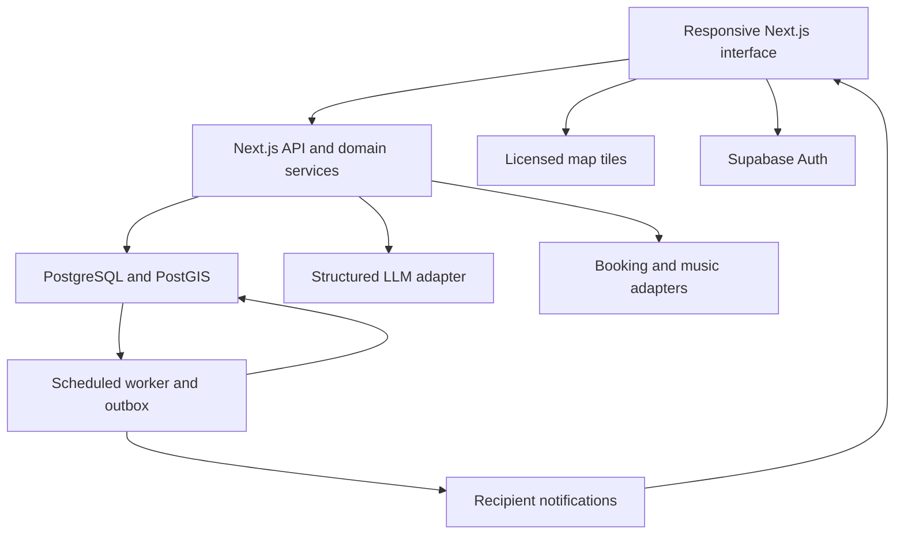

# DeskHop Product and Engineering Blueprint

Version 1.2 · September 19, 2026

**Build a campus study companion that helps students find a suitable place, reserve supported rooms, and complete study sessions with friends.** The defining experience is a useful recommendation backed by specific evidence: the place is open for the requested time, has the amenities the student needs, and has recent information about its conditions.

This specification makes the product and engineering decisions needed to begin implementation. It includes the complete product direction, a smaller working hackathon release, database invariants, API behavior, and acceptance criteria. Numeric limits, scoring weights, budgets, and pilot targets are proposed defaults to validate, not measured performance or vendor quotations. Code blocks are implementation references; a running application and applied database migrations are subsequent deliverables.

For team kickoff, read Sections 1–5, 14, and the current release selection in Section 38. Section 22 preserves the original estimates. Backend implementation starts with Sections 8 and 16–19; the social additions are specified in Sections 27–30 and 36–37. Integration decisions are in Sections 9, 12, and 13. The release gates and demonstration are in Sections 23, 24, and 38.

Version 1.1 adds the login activity bubble, interactive location previews, friend statuses, and explicitly shared availability. Sections 27–31 specify their behavior and implementation. Their additional effort is listed separately from the original 99-hour backlog.

Version 1.2 establishes DeskHop as the product name and DeskHop Plus as the paid plan. Sections 32–38 define the brand, reusable visual tokens, logo, interface patterns, and the new Hopping over arrival flow. These decisions extend the existing product and authorization rules; they do not turn travel intent into a reservation or a physical check-in.

## 1 Product decisions

| Decision | Chosen approach | Reason |
| --- | --- | --- |
| Brand name | DeskHop | User-selected name; use this capitalization throughout the product. |
| Initial audience | Students around one campus; Mines and nearby Golden venues are a sensible first pilot. | A small area can have useful, verified coverage quickly. |
| Launch catalog | Approximately 20–30 manually verified study locations. | A reliable small catalog makes discovery immediately useful. |
| Primary outcome | A student starts a suitable study session with less searching. | This ties discovery, reservations, and social features to one purpose. |
| Delivery | Responsive web application; installable PWA enhancements after the core release. | One application serves phones and laptops. |
| Planning assumption | Four builders, 48 elapsed hackathon hours, approximately 28–32 focused hours per person. | Leaves time for sleep, integration, and the presentation. |
| Architecture | One Next.js application with domain modules and managed PostgreSQL. | The team can share types, deployments, and transactions. |
| Real reservations | Only rooms controlled by the app or connected through an authorized provider. | A confirmation must correspond to a real inventory commitment. |
| Crowd information | Recent reports with timestamps and evidence strength. | App participation cannot establish total occupancy. |
| Social distinction | Following means reading reviews; friendship means mutually approved private sharing. | A follower should never silently gain access to someone's current location. |
| Monetization | Free discovery and recent reports; DeskHop Plus assistance and, later, validated forecasts. | Useful free information encourages the contributions needed for better recommendations. |

**Product promise:** “Find a place that fits this study session.” A map alone does not fulfill that promise; the application should explain its recommendation and help the student act on it.

**Scope discipline:** The full product below is the destination. The hackathon's release contract in Section 2 determines what must actually work by judging time.

## 2 Feature scope and release contract

P0 means the working hackathon release. P1 means the next campus pilot release. P2 requires data, partnerships, or more operating maturity. A feature marked optional must never block the P0 demonstration.

| Feature | Full product behavior | Delivery |
| --- | --- | --- |
| Nearby study spots | Map and equivalent list, categories, distance, hours, filters, saved spots. | P0; saving optional |
| Spot details | Power, charging equipment, capacity, access restrictions, noise, photos, official menu link. | P0; use verified static data |
| Native reservations | Availability, booking confirmation, cancellation, conflict handling, My Bookings. | P0 on clearly labeled demo inventory or an authorized venue |
| External reservations | Open the venue's official reservation page. | P0 |
| Provider booking integration | Read availability and book through an approved institutional API. | P2; institution dependent |
| Reviews | Noise and crowd scores, notes, update/delete, report abuse. | P0 |
| Review likes | One like per account per review; reversible. | P1 or P0 stretch |
| Study timer | Persistent session with finish/cancel and privacy choice. | P0; pause/resume is P1 |
| Friendship | Request, accept, remove, block; friends can see approved session activity. | P0 |
| Login activity bubble | One dismissible summary of currently shared friend activity after sign-in. | P0 addition; Section 27 |
| Location preview | Hover, keyboard focus, or tap reveals quietness, coffee, and other spot facts. | P0 addition; Section 28 |
| Friend availability | Explicit, expiring available/open-to-company/busy/do-not-disturb status. | P0 addition; Sections 29–30 |
| Hopping over | Tell one eligible friend that you are heading to their shared spot, with optional self-reported arrival timing. | Revised P0 slice; Sections 36–38 |
| DeskHop visual identity | Consistent logo, colors, type, component states, and plain branded language. | P0; Sections 32–35 |
| Completion notifications | One in-app completion update for eligible opted-in friends. | P0 |
| Followed reviewers | Follow/unfollow and a feed of public reviews. | P1 |
| Spotify Jam sharing | Attach a user-created Jam invitation link to a friends-only session. | P1; original P0 stretch is deferred in Section 38 |
| Spotify Now Playing | Opt-in live listening card for connected users. | Restricted technical demo; rollout requires viable platform access |
| Current conditions | Separate recent crowd reports from historical reviews. | P0 |
| AI search | Convert natural language into validated filters and return real candidates. | P0 stretch after the release gates pass; P1 required |
| AI booking | Produce a reservation proposal; user confirms through the normal booking service. | P1; original P0 stretch is deferred in Section 38 |
| Busy-time forecast | Historical patterns with sample requirements and uncertainty. | P2 |
| Payments | Server-enforced DeskHop Plus entitlement and subscription lifecycle. | P1; use demo entitlement in P0 |
| Venue administration | Edit facts, hours, inventory, and venue reports; moderate corrections. | Minimal seed/admin workflow P0; portal P1 |

The P0 success scenario is: sign in, find a quiet spot with power, book a supported room, start a session, show a friend an approved update, finish, and leave a review. Every step must survive a page refresh and involve persisted server data. A separate attempt to book the same room must correctly fail.

If the team has two people or only 24 hours, ship discovery, spot detail, and one native booking flow using the DeskHop visual tokens. Treat AI search as stretch and defer friendship, Hopping over, and the timer to the next release. Do not weaken booking correctness to preserve secondary features.

## 3 Users and permissions

| Role | Allowed actions |
| --- | --- |
| Guest | Browse public venues and published reviews; filter manually without location permission. |
| Signed-in student | Reserve eligible rooms, review spots, report conditions, run sessions, save spots, manage relationships. |
| DeskHop Plus member | Use entitled assistant actions and qualifying forecast views. Subscription does not override venue eligibility. |
| Venue manager | Maintain only assigned venue records and inventory; view necessary booking administration data. |
| Application moderator | Review flagged content and corrections; suspend abusive accounts with an audit record. |

Email ownership and campus membership are different checks. A verified email is sufficient for community actions. An institution-restricted room needs the institution's required identity or approved policy; merely typing an email ending in a campus domain is insufficient.

Keep access rules in the service layer and database. A hidden button does not establish permission.

## 4 The user journeys

### Find a place for a specific session

1. The home page opens around the chosen campus. It offers “Use my location” and manual area search; browsing does not require an account.
2. The student selects Solo focus, Group work, or Coffee and study. These presets set editable preferences.
3. Filters cover category, open for the full visit, power, noise preference, group size, price expectation, and access eligibility.
4. Results show the venue name, distance, opening status, power information, and a brief explanation of fit. A crowd badge includes its age or says “No recent reports.”
5. Selecting a result opens spot details, with Directions, Start studying, and the applicable reservation action.
6. Signing in happens when the student chooses an account-dependent action. Preserve their filters and selected spot through the sign-in redirect.

### Reserve a room

1. Choose date, start time, duration, and party size.
2. Show only eligible intervals in native inventory; external booking uses a clearly labeled official-site button.
3. Display the room, local date and time, capacity, access requirements, and cancellation policy.
4. The user presses Confirm reservation. The server revalidates availability and performs the transaction.
5. Success returns a reservation identifier and shows the booking in My Bookings. A conflict returns alternatives without claiming a booking exists.
6. Cancel from My Bookings. Refreshing, double-clicking, or retrying after a network failure must not create an additional booking.

### Study with friends

1. Start a 25-, 50-, or custom 15–180-minute session at a selected venue or without a venue.
2. Choose Private, Friends see status, or Friends see status and venue. Default to Private until the user changes it.
3. Optionally share a Jam link. Music sharing has its own switch; venue sharing does not enable it.
4. The timer restores from the server after a refresh. Friends see only the allowed information.
5. Reaching the target prompts the student to finish or extend. It does not claim they actually studied merely because a timer elapsed.
6. Confirming Finish records the session and optionally notifies eligible friends. The review prompt asks whether the student wants to describe the venue.

### Ask the assistant

Example: “Find somewhere quiet with outlets near campus for three people from 3 to 4:30.”

The assistant resolves the date and campus timezone, asks about a genuinely missing required constraint, and queries the same search and availability services used by the normal interface. It returns up to three cards with evidence and tradeoffs. If a room can be booked, it displays a confirmation card. No supported room means it offers suitable walk-in venues or official reservation links.

## 5 Screens and navigation

Mobile navigation has Discover, Study, Friends, and Profile. My Bookings and Saved live under Profile, with an upcoming booking also visible on Discover. The assistant is available from Discover and spot details. Desktop uses the same information architecture with a map/list split.

| Route | Main content | Main action | Required alternate states |
| --- | --- | --- | --- |
| `/discover` | Search, filters, list/map, nearby candidates. | Open spot. | No permission, no matches, map unavailable, outside coverage. |
| `/spots/[id]` | Facts, hours, conditions, reviews, rooms, menu. | Directions, Study, Reserve. | Closed, unknown hours, stale report, restricted access. |
| `/spots/[id]/rooms` | Date, time, party size, room availability. | Review reservation. | Fully booked, external provider only, unavailable integration. |
| `/bookings` | Upcoming and recent bookings. | View/cancel booking. | Empty, cancellation pending for a provider. |
| `/study` | Current timer or start form, privacy controls. | Start/finish. | Resumed session, offline, target reached, another session open. |
| `/friends` | Requests, shared activity, and explicitly shared availability; All and Available now filters. | Add friend, open a shared venue, or set own availability. | No friends, sharing disabled, expired status. |
| `/feed` | Published reviews from followed users. | Open spot/review. | No follows, removed review. P1. |
| `/u/[handle]` | Public review identity and published reviews. | Follow or request friendship. | Blocked/unavailable profile. |
| `/settings` | Privacy, notification choices, connections, deletion. | Save preference. | Reauthentication or reconnect required. |
| `/admin` | Assigned venue edits and moderation queue. | Publish validated update. | No authorized role. |

Spot detail order: identity and primary actions; “Is this suitable now?” summary; amenities and access; rooms; reviews; venue contact/menu. Show source and freshness next to uncertain facts.

Use warm neutral backgrounds with a restrained green accent, readable typography, and compact comparison cards. Crowd states need text labels and icons as well as color. Keep focus sessions visually calm. Provide keyboard-accessible filters, visible focus, labeled controls, and a fully usable list without the map. Do not auto-play audio or send a screen reader a timer announcement every second.

Use the concrete DeskHop brand and component rules in Sections 32–35 for implementation. The four main navigation labels remain Discover, Study, Friends, and Profile. Use the word Hop for the specific social arrival flow, while booking, directions, and study controls keep their familiar names.

## 6 Venue data and the first catalog

There are three distinct facts: a building's physical seat capacity, a report about current conditions, and inventory that can actually be reserved. Store and label them separately.

| Field | Representation and rule |
| --- | --- |
| Category | `library`, `cafe`, `campus_space`, `coworking`, `outdoor`, `other`. A primary category plus optional tags. |
| Coordinates | WGS84 point; latitude/longitude order is explicit at every API boundary. |
| Timezone | IANA identifier, initially `America/Denver`. Store timestamps in UTC. |
| Hours | Local weekly periods plus date-specific overrides. Support split hours, overnight periods, holidays, and unknown hours. |
| Public access | `public`, `campus_only`, `membership`, `purchase_expected`, `unknown`, with explanatory notes. |
| Power outlets | `none`, `some`, `many`, `unknown`; optional location note such as “along the east wall.” |
| Loaner chargers | Separate `yes`, `no`, `unknown`, with connector types if verified. An outlet does not mean a charger is available. |
| Seating capacity | Nullable positive integer plus source and verification date; estimates are labeled. |
| Noise | Posted quiet policy and community noise observations are different fields. |
| Wi-Fi | `yes`, `no`, `unknown`; avoid promising speed without measurements. |
| Accessibility | Specific verified attributes, such as step-free entrance; unknown is never converted to accessible. |
| Menu | Official HTTPS menu URL and last checked date. The initial release links out. |
| Coffee | `sold_on_site`, `free_on_site`, `none`, or `unknown`, with source/date and service hours if known. On-site service is separate from a nearby cafe or permission to bring coffee. |
| Pricing | Free seating, purchase expected, or known venue charge. Avoid stale item-level menu prices. |
| Photos | Owner/team-provided or otherwise licensed images, attribution, and alt text. |
| Provenance | Source URL or staff verification, `verified_at`, and author of the update. |

Start with a spreadsheet-like admin seed form or validated JSON import. Team members verify each public venue's coordinates, access, opening hours, power, and official website. All unknowns remain visible. A student can submit a correction; an editor reviews it before it becomes canonical. Reported noise and crowds can update condition summaries without changing the venue's permanent facts.

Suggested maintenance defaults: check menus monthly, opening hours weekly during the pilot, and exceptions around holidays and exam periods. Show the last verification date; never imply current accuracy solely because a record exists.

Use MapLibre for the map and a licensed tile service such as MapTiler. The map renderer does not supply a venue catalog or occupancy. The first catalog is independently curated. Both components have official documentation: [MapLibre](https://maplibre.org/maplibre-gl-js/docs/) and [MapTiler](https://docs.maptiler.com/sdk-js/).

If Google Places is introduced later, implement its storage and attribution rules as a distinct data-source policy before importing content into the catalog. [Google Places policies](https://developers.google.com/maps/documentation/places/web-service/policies).

## 7 Discovery and recommendation logic

### Search first, score second

Hard constraints remove ineligible candidates: selected area, public visibility, access rules, required amenities, group capacity when verified, opening interval, and native room availability when requested. Unknown power does not satisfy “must have outlets.” Unknown opening hours do not satisfy “open for my entire session.” Offer a clearly labeled relaxed search instead of silently changing a requirement.

For a reserved room, its capacity can satisfy a party-size requirement. For walk-in seating, total venue capacity cannot establish that a group can sit together. Use verified group-table attributes as a preference and explicitly leave current adjacent-seat availability unknown.

Soft preferences determine ordering. An initial transparent score can use proximity 35%, noise fit 30%, preferred amenities 20%, and recent crowd suitability 15%. These are tuning choices. Remove unavailable soft signals and renormalize their weights, while separately displaying evidence coverage. Do not use an unavailable crowd signal as evidence of an empty venue. An exact requirement always outranks this preference score.

Use distance in meters from PostGIS. Default radius is 3 km, capped at 25 km, with a user-controlled widening action. Query a bounded viewport and cluster markers as the catalog grows. Paginate 20 records, with stable tie-breaking by spot ID. [Supabase PostGIS guide](https://supabase.com/docs/guides/database/extensions/postgis).

Straight-line distance must be called distance, not walking time. For the hackathon, Directions opens an external map. Add licensed pedestrian routing later if travel time becomes a product requirement.

### Time correctness

Calculate “open for this visit” against the complete interval after converting it into the venue's timezone. Date overrides take priority over weekly hours. Check overnight carryover from the previous day. Keep daylight-saving transitions explicit: reject nonexistent local times and ask the user to choose the intended occurrence of an ambiguous time. Availability and booking services share this implementation.

### Location behavior

Request browser location only after a clear user action. Use it for the current search; keep precise coordinates out of application analytics and ordinary request logs. A manual campus/area choice supports users who decline. Browser geolocation requires permission and a secure context. [MDN Geolocation API](https://developer.mozilla.org/en-US/docs/Web/API/Geolocation_API).

Do not run continuous GPS tracking. For a voluntary crowd-report proximity check, evaluate the coordinate once and retain only the derived verification category and venue ID. Proximity is weak evidence because device location can be inaccurate or spoofed.

## 8 Reservations that actually work

### Booking modes

| Mode | User experience | Authority |
| --- | --- | --- |
| `native` | Check availability, confirm, cancel inside DeskHop. | DeskHop owns the authoritative inventory for an authorized venue. |
| `provider` | Same interface, backed by an approved provider adapter. | The provider's confirmed response and booking reference. |
| `external_link` | “Reserve on venue website.” | The venue's website. A click creates no confirmed DeskHop booking. |
| `none` | Walk-in information only. | No reservable inventory. |

Room providers can support integrations: LibCal documents read/write APIs for bookings. That does not establish access to a particular institution's account. Treat credentials, user eligibility, provider rules, and test access as partnership dependencies. [LibCal integration capabilities](https://www.springshare.com/libcal).

A room in a seeded hackathon database must be labeled demo inventory unless the venue has agreed that DeskHop manages it. The same transaction code can operate real authorized inventory later.

### Initial native rules

- 30-minute start increments; duration 30–120 minutes; maximum seven days in advance.
- Party size 1 through verified room capacity; room and venue access must both allow the user.
- The full interval must fit known opening periods, room schedules, and closure overrides.
- One user cannot hold overlapping confirmed reservations. Set a maximum of two upcoming reservations and four booked hours per venue-local day; validate under a user lock.
- Cancellation is allowed before the start for the initial free-room policy. Configure a different venue policy explicitly; paid reservations are outside P0.
- No temporary holds in P0. Availability is advisory until Confirm succeeds.
- Store the cancellation/access policy version with the booking so later venue edits do not rewrite what the user accepted.

### Native booking transaction

1. Authenticate the caller, validate input, and identify the room on the server.
2. Begin a transaction and lock the caller's private account row. Native booking and cancellation code use the same lock order: user, room, reservation if present.
3. Inspect the unique idempotency record for `(user_id, operation, key)`. Return its original result for an identical payload; reject key reuse with a different payload.
4. Lock the room row, read current policy/hours, and validate all rules again.
5. Insert the confirmed reservation. Database exclusion constraints reject an overlapping interval even if application availability checks raced.
6. Insert the booking event into the outbox and save the response against the idempotency key, in the same transaction.
7. Commit and return the reservation. The worker can then create notifications.

Use half-open intervals `[start, end)` so a reservation ending at 15:00 permits one beginning at 15:00. PostgreSQL range exclusion constraints support this rule. [PostgreSQL range constraints](https://www.postgresql.org/docs/current/rangetypes.html#RANGETYPES-CONSTRAINT).

```sql
-- Core native-inventory constraints; not a complete migration.
-- rooms, profiles, grants, RLS, policy checks, and transactional RPCs
-- are defined by the application migration implementing this specification.
CREATE EXTENSION IF NOT EXISTS btree_gist;

CREATE TABLE public.reservations (
  id uuid PRIMARY KEY DEFAULT gen_random_uuid(),
  user_id uuid NOT NULL REFERENCES public.profiles(id),
  room_id uuid NOT NULL REFERENCES public.rooms(id),
  starts_at timestamptz NOT NULL,
  ends_at timestamptz NOT NULL,
  party_size integer NOT NULL CHECK (party_size > 0),
  status text NOT NULL DEFAULT 'confirmed'
    CHECK (status IN ('confirmed', 'cancelled', 'completed', 'no_show')),
  policy_version integer NOT NULL,
  created_at timestamptz NOT NULL DEFAULT now(),
  CHECK (ends_at > starts_at),
  EXCLUDE USING gist (
    room_id WITH =,
    tstzrange(starts_at, ends_at, '[)') WITH &&
  ) WHERE (status = 'confirmed'),
  EXCLUDE USING gist (
    user_id WITH =,
    tstzrange(starts_at, ends_at, '[)') WITH &&
  ) WHERE (status = 'confirmed')
);
```

Do not put `now()` in a partial exclusion predicate. Keep the predicate based on stored status and handle time-based transitions explicitly. Ending a study timer never cancels a reservation. A timer and a booking are separate records.

### Provider failure handling

Provider integration adds `pending_confirmation`, `confirmed`, `failed`, `cancellation_pending`, `cancelled`, and `needs_reconciliation` states in a separate provider-booking table. Never keep a database transaction open while waiting for its network request. Create an intent, call the adapter with an idempotency reference if supported, then record the result.

A provider timeout can mean the booking succeeded but the reply was lost. Reconcile by provider reference or client request reference before retrying. If the provider supports neither reliable idempotency nor lookup, do not blindly retry the write; surface “Checking reservation” and resolve it through the venue. An outbound-site click cannot become “Confirmed” through a client-side flag.

## 9 Crowd conditions and forecasts

### What the product can honestly know

The Places API field schema reviewed for this plan does not document a Popular Times or live occupancy field. Therefore, the architecture does not assume one is available. That is an inference from the published schema, not a claim about Google's internal capabilities. [Google Place schema](https://developers.google.com/maps/documentation/places/web-service/reference/rest/v1/places).

DeskHop should collect short, structured observations from people at a venue. App session counts are not venue occupancy: students can study elsewhere, leave a timer running, or never use the app. Likewise, a room reservation does not establish the number of people physically present.

### A report takes a few seconds

Ask “How many seats seem available?” with five anchored answers: mostly empty, plenty available, about half occupied, only a few seats left, and effectively full. Also offer a noise scale: silent, quiet, conversational, lively, and loud. Provide text descriptions rather than unlabeled numeric sliders.

Keep the latest current report from each account at each venue. Allow a replacement at most every ten minutes and at most twelve reports per account per day during the pilot. Require a verified account, record the server receipt time, and accept an observation time only within five minutes of receipt. A review about yesterday cannot be submitted as a live report.

### Initial aggregation specification

1. Select reports from the last 45 minutes, excluding suspended users and moderated reports; take only the newest report per person.
2. Assign recency weight `2 ^ (-age_minutes / 15)`. Multiply by evidence weight 1.0 for a successful voluntary proximity check or 0.5 for an unverified self-report. These are heuristic weights, not probabilities.
3. Require at least three distinct eligible contributors, summed weight at least 1.0, and the newest report at most 15 minutes old. Otherwise return `insufficient_data`.
4. Compute a weighted median of the 1–5 crowd answers. Separately calculate effective sample size `(sum(weights)^2) / sum(weights^2)` and weighted spread.
5. If weighted interquartile spread exceeds two scale points, return `conflicting_reports`. Otherwise label evidence moderate when effective sample size is at least three, and limited below that. Reserve strong evidence for validated venue measurements or a later calibrated rule.
6. Cache the result for at most 60 seconds and also evaluate `expires_at` on read. Cached data must never outlive the newest report's freshness window or other eligibility thresholds; recalculate if a boundary was crossed.

Possible UI: “A few seats left · 3–5 recent reports · latest 6 min ago · moderate evidence.” Never turn these ordinal responses into an invented “87% full” or “exactly 12 seats left.” A full report is an observation, not a guarantee that the next visitor cannot get a seat.

Show official venue counts separately if a partner can supply reliable occupancy and capacity. Display the measurement's timestamp, method, and coverage. Until validated, do not mix that number into the community scoring formula.

Suppress contributor identities in crowd summaries. Prefer a coarse report-count bucket such as 3–5 or 6–10 in the public interface, and avoid releasing individual report timestamps or public presence counts. Historical public reviews remain a separate, knowingly published contribution.

### Future forecast

Begin with a weekday and half-hour historical baseline using matching academic-calendar periods. Require at least four comparable dates and twelve usable observations before showing a bin. Deduplicate each account's contribution within each bin. Report “usually quieter” with coverage information, not a guaranteed seat count.

Compare predictions with later observations using time-separated validation. A forecast launches only if it improves on a simple recent-conditions or typical-weekday baseline. Suppress predictions during unmodeled closures, holidays, or exams. Advanced machine learning can follow when the dataset justifies it; no vector database is needed for this problem.

## 10 Sessions and social behavior

### Session state and timer accuracy

Use these persisted states: `running`, `paused`, `awaiting_confirmation`, `completed`, `cancelled`, `abandoned`. P0 exposes start, finish, cancel, and extend; pause/resume arrive in P1. Store `started_at`, `target_seconds`, `focus_seconds`, `segment_started_at`, `last_heartbeat_at`, `revision`, and `ended_at`. Only one nonterminal session may exist per account.

Elapsed focused time is stored accumulated seconds plus server time since the current running segment began, capped at the remaining target. The browser animates that calculation; it does not authoritatively add one second at a time. On every mutation, the server first materializes elapsed time and increments the revision. Stale revisions return a conflict with the current state. Timers in background tabs can be throttled, which is why persisted timestamps matter. [MDN Page Visibility API](https://developer.mozilla.org/en-US/docs/Web/API/Page_Visibility_API).

At the target time, a scheduled job or the next request moves the session to `awaiting_confirmation`. This stops accrual until the user finishes or explicitly adds time. A six-hour inactivity deadline moves any remaining open session to `abandoned`. Neither target arrival nor abandonment publishes a completion event.

Send a heartbeat every 60 seconds only while the page is visible. Heartbeats indicate recent app contact, not physical occupancy or verified attention. Without a heartbeat for ten minutes, stop showing the session as current friend activity; its private timer can still be recovered. Allow studying without a venue. Total minutes are self-reported habit information.

### Relationship semantics

| Relationship or control | Meaning |
| --- | --- |
| Follow | One-way subscription to published reviews. No session or music access. |
| Friend request | Pending invitation that reveals no extra private data. |
| Accepted friendship | Two-way relationship enabling explicitly shared session fields. |
| Remove friend | Stops future private reads and pending activity delivery. Following is separately controlled. |
| Block | Prevents either side's authenticated interactions, requests, private activity, and personalized feed visibility. |
| Mute | Stops activity notifications without changing the relationship. |
| Session privacy | Per-session private, friends-status, or friends-status-and-venue. |
| Music sharing | Separate opt-in, limited to authorized friends and the active session. |

Store one canonical friendship row per unordered pair and record who sent the request. Two crossing requests must not create duplicate friendships or auto-accept without a deliberate product rule. For P0, return the existing incoming request and let the user accept it.

A block cannot make a deliberately public review invisible to a logged-out person. The interface should explain that public reviews are public; privacy for session information is enforced independently. Delete or hide a public review if the author wants to withdraw it.

### Feed and notification rules

The Friends view shows eligible live sessions. The Following feed contains published reviews ordered by creation time with cursor pagination. Keep these queries distinct.

Version 1.1 adds a current-state login bubble and user-declared availability to the Friends view. The bubble is a fresh summary fetched when the app opens, not a new study-start push notification. Section 29 distinguishes session activity from willingness to meet; ending a timer never automatically sets someone available.

Notify only on an explicit completed-session transition of at least ten focused minutes, when the sender chose to share completion and the recipient opted in. Start alerts are off by default. Use in-app notifications initially, batch repeated activity where useful, and cap social alerts from one sender to one recipient at three per day. Booking status notifications are a separate category.

Create domain events transactionally in an outbox. The worker checks current friendship, block state, sender sharing, and recipient preferences before delivery. Each notification has a unique deduplication key. Reads also recheck eligibility, so a previously queued private update does not leak after unfriending. Do not store venue details in notification text snapshots; resolve permitted details at read time. A future push notification should contain a generic message and an authenticated link.

## 11 Reviews and community trust

A review contains a 1–5 noise score, a 1–5 crowd score describing the visit, an optional 1–5 overall suitability score, a visit date, and notes up to 2,000 characters. Ask for context such as solo/group and time of day. A quiet cafe at 9 a.m. may be loud at noon.

Use one active review per user per venue in the first product. Revisiting updates the review; the server retains modification metadata and rate limits editing. Sort by recent or helpful, and show the number of reviewers alongside aggregated scores. Likes express usefulness and must not change the underlying factual noise score. A unique `(review_id, user_id)` key prevents duplicate likes; disallow self-likes.

Authors can edit or remove their reviews. Signed-in readers can report spam, harassment, or incorrect information. Moderators can hide a review and record a reason. Venue managers can propose corrections to canonical venue facts and later respond to reviews, but cannot remove criticism themselves.

Treat notes as plain text, not rendered HTML. Keep a pending moderation queue for newly flagged content. Use simple rate limits and verified accounts first; complicated reputation scores are unnecessary for the hackathon. Photo uploads, replies, and review version history are P1 or later.

## 12 Spotify integration

There are two different integrations, with different feasibility.

**Jam links:** The user starts a Jam in Spotify and pastes its share link into an explicitly shared DeskHop session. Friends choose “Join in Spotify.” Spotify's documented flow supports invite links; hosting and joining remotely require Spotify Premium. DeskHop Plus does not include Spotify Premium. [Spotify Jam help](https://support.spotify.com/us/article/jam/).

Do not promise automatic Jam creation through an undocumented endpoint. Treat links as revocable invitation secrets: only accepted, unblocked friends with current music access can fetch them, and delete the stored link at session end. The host can remove guests or end the Jam in Spotify; DeskHop cannot revoke a link someone already copied. Validate HTTPS against a small allowlist of actual Spotify share-link hosts observed during integration testing. Reject arbitrary redirects and never fetch user-supplied URLs from the backend.

**Now Playing:** Each participant connects their own Spotify account; the application reads that participant's current playback and exposes a minimal friends-only card under their sharing choice. The documented endpoint uses `user-read-currently-playing`. [Spotify currently playing endpoint](https://developer.spotify.com/documentation/web-api/reference/get-the-users-currently-playing-track).

Spotify's current development mode requires the app owner to have Premium and permits up to five allowlisted authenticated users. The current extended-access criteria are substantial, including an established organization and at least 250,000 monthly active users. Broad Now Playing rollout is therefore an unresolved platform dependency, not a routine step after the hackathon. Jam-link sharing keeps the core social idea useful without relying on this expansion. [Spotify quota modes](https://developer.spotify.com/documentation/web-api/concepts/quota-modes).

For the restricted demo, use authorization code with PKCE, a state nonce, exact registered redirect URIs, and encrypted server-side tokens. Never expose another person's token. Request only necessary scopes and honor disconnect by deleting tokens and cached playback.

Poll the owner only while the session and music sharing are active and the page is visible, initially no faster than every 30 seconds. Coalesce multiple viewers into one refresh, keep a short cache, respect rate-limit responses, and stop when quota is exhausted. Blank, unavailable, private, disconnected, and unsupported playback are legitimate states. Hide stale playback after 90 seconds. Test that the selected endpoint exposes enough information to honor private listening; if it does not, keep the feature disabled until the necessary permitted check is implemented.

Spotify metadata stays out of assistant prompts, embeddings, and training data. Spotify's policy prohibits ingesting its content into AI or machine-learning models. Keep the music module outside the assistant's tool/data boundary. [Spotify Developer Policy](https://developer.spotify.com/policy).

## 13 The assistant is a constrained application feature

The assistant's value is converting a request into useful, executable application actions. It has the same permissions, inventory, and data freshness as the ordinary interface.

Use a server-side LLM adapter that supports structured tool calls. Choose the model at implementation time by testing a small set of representative requests for accuracy, latency, and cost; store the model name in configuration. The application contracts must not depend on a particular model vendor.

| Tool | Accepted input | Returned information | Writes? |
| --- | --- | --- | --- |
| `search_spots` | Validated area, interval, hard constraints, preferences. | Ranked candidate IDs with evidence fields. | No |
| `get_spot` | Known spot ID. | Permitted facts, provenance, and current summary. | No |
| `get_room_availability` | Room/spot ID, UTC interval, party size. | Native/provider availability or external-link mode. | No |
| `prepare_reservation` | Supported room ID, interval, party size. | Server-generated, expiring confirmation proposal. | Creates a proposal, not a booking |

The model cannot call arbitrary URLs, execute SQL, change relationships, access private Spotify data, or directly confirm a booking. Domain services return minimal structured data; user coordinates and friend identities are omitted unless necessary for the explicitly requested action.

### Search execution

1. Validate account entitlement and request limits on the server.
2. Resolve a natural-language request into a strict search schema. Missing date, timezone, or ambiguous time gets clarification when it changes the answer.
3. Run deterministic search and ranking against the database; never accept model-invented venue IDs.
4. Return candidate cards with exact reasons, such as verified outlets, known closing time, and the age of recent observations.
5. Let the model explain tradeoffs using only those returned fields. A missing fact remains unknown.

### Booking confirmation

`prepare_reservation` records a user-bound proposal containing room ID, times, party size, current policy version, an expiry of two minutes, and a hash of a random confirmation token. This is not a hold. The UI shows the exact details and the user presses Confirm.

The ordinary booking endpoint consumes the proposal inside its booking transaction, rechecks availability and policy, and creates the reservation. Proposal consumption and booking creation commit together. Repeated confirmation returns the same reservation; modified details require a new proposal. If the proposal expires or policies change, show a fresh review card. The model never receives the confirmation secret.

### Limits and failure behavior

Initial defaults: 20 assistant requests per user per day, no more than four tool rounds per request, bounded candidate lists, a 15-second overall deadline, and a configurable daily provider spend ceiling. These are launch guardrails to tune. Never charge a successful-booking metric on an assistant explanation alone.

On model failure, show the normal filters with any validated criteria preserved. A booking result is rendered from the service response even if the model cannot explain it. Treat review notes and venue descriptions as untrusted data that cannot alter tool instructions. Prefer structured facts over free-text reviews in P0 prompts.

## 14 Application architecture

Use a modular monolith: one deployable web application, with modules for Catalog, Booking, Sessions, Social, Conditions, Assistant, and Integrations. Each module exposes typed service functions. Routes authenticate, validate, invoke a service, and serialize its output; they do not duplicate business logic.



| Layer | Choice | Responsibility |
| --- | --- | --- |
| Web UI | Next.js App Router, React, TypeScript. | Responsive routes, forms, map/list, server-rendered public details. |
| Styling | Tailwind and a small accessible component library. | Consistent controls; few custom widgets. |
| Validation | Shared Zod schemas. | Validate all client inputs and provider/LLM outputs. |
| Browser data | TanStack Query or equivalent; URL state for search filters. | Query caching, retries, invalidation, and restored filters. |
| Application API | Next.js Route Handlers in Node runtime. | Auth, authorization, domain orchestration, integrations. |
| Database | Supabase PostgreSQL with PostGIS and `btree_gist`. | Persistent state, geographic search, atomic invariants. |
| Identity | Supabase Auth; verified email and optional configured OAuth sign-in. | User sessions and account verification. |
| Data access | Supabase client for authorized queries; SQL RPCs for atomic workflows. | Keep business transactions in the database where needed. |
| Storage | Supabase Storage after uploads are introduced. | Private or published images under explicit bucket policies. |
| Background execution | Supabase Cron and a protected Edge Function worker. | Outbox delivery, expiration, summaries, reconciliation. |
| Live updates | Short polling for friends/conditions; optional private notifications subscription. | Current views without revealing raw private session rows. |
| Maps | MapLibre with licensed tiles; first-party venue data. | Geographic presentation. |
| Payments | Stripe hosted checkout and verified webhooks in P1. | Paid subscription state and server-derived entitlements. |
| Hosting | Vercel or equivalent supported Next.js host; colocate with DB region. | Preview and production deployments. |

Next.js provides Route Handlers for the API boundary, and Supabase supplies documented database scheduling and realtime authorization capabilities. Pin a supported stable release set and commit the package lock before building. [Next.js Route Handlers](https://nextjs.org/docs/app/getting-started/route-handlers), [Supabase Cron](https://supabase.com/docs/guides/cron), [Realtime authorization](https://supabase.com/docs/guides/realtime/authorization).

P0 does not need Redis, Kafka, Elasticsearch, a separate Express backend, a vector database, or Kubernetes. Add a new service only when a measured workload requires its independent scaling or lifecycle.

## 15 Request paths and module boundaries

**Public browsing:** Browser sends the selected area and constraints to the catalog route; the route validates bounds and runs a parameterized PostGIS query; the service returns public facts and permitted condition summaries. Maps download their own licensed tiles. A map failure leaves the list working.

**User mutation:** Browser sends its authenticated request and an idempotency key; the server verifies identity and policy; an authorized SQL function executes the atomic write and outbox event; the UI receives the saved state. Do not trust a client-supplied user ID, role, premium flag, or booking status.

**Private social read:** Browser requests its Friends view; the service joins current accepted friendships, block exclusions, session expiry, and sharing choices; it returns a minimal per-viewer projection. Raw session rows and exact coordinates are never broadcast to all clients.

**Background event:** A durable outbox row is claimed by a worker, processed, and marked delivered. Use retry counts, exponential backoff, and a dead-letter state after five failures. Delivery is at least once; effects such as notifications are idempotent. A worker restart must not lose the event.

**Provider action:** Booking and music adapters operate only on the server. Provider-specific failures are converted to typed application errors. The rest of the product can remain available when one integration is down.

Keep public catalog caches separate from authenticated responses. Mark bookings, profile settings, Friends, and assistant conversations private and non-cacheable by shared CDNs. A session refresh response with authentication cookies must not be stored in a shared cache.

## 16 Database model

Use UUID primary keys, `timestamptz` event times, explicit foreign keys, and database checks in addition to request validation. Core business fields should have typed columns. JSONB is appropriate for a small validated amenity object, hours periods, and notification preferences; it is not a substitute for relational booking or friendship records.

### Identity and catalog

| Table | Important columns | Invariants and indexing |
| --- | --- | --- |
| `profiles` | `id`, `handle`, `display_name`, `avatar_path`, `created_at` | ID maps to Auth identity; case-normalized unique handle. Contains only public identity fields. |
| `private.accounts` | `user_id`, `timezone`, `default_session_visibility`, `notification_preferences`, `account_status` | One row per user. Own-account read; server-controlled status. Also provides the booking quota lock. |
| `private.friend_availability` | `user_id`, nullable `mode`, nullable `session_id`, `expires_at`, `updated_at`, `revision` | One current record per user; explicit modes and atomic session rules in Section 30; raw row owner/server only. |
| `private.hop_intents` | `id`, `user_id`, `spot_id`, `target_user_id`, `target_session_id`, `state`, optional `eta_at`, `expires_at`, `revision`, timestamps. | One active on-the-way intent per sender; only owner and an independently eligible selected recipient receive projections. Section 37. |
| `spots` | `id`, `slug`, `name`, `category`, `location geography(Point,4326)`, `timezone`, `access_type`, `hours`, `hour_overrides`, `amenities`, `seat_capacity`, `menu_url`, `official_url`, `field_sources`, `published_at` | Unique slug; GiST location index; validated hours/amenity shapes; null capacity means unknown. |
| `rooms` | `id`, `spot_id`, `name`, `capacity`, `booking_mode`, `booking_url`, `policy_version`, `policy`, `schedule`, `active` | Positive known capacity for native rooms; indexed spot ID. Provider identifiers stay in private integration records. |
| `private.venue_memberships` | `user_id`, `spot_id`, `role` | Unique user/spot pair; only authorized staff can assign roles. P1 portal. |
| `saved_spots` | `user_id`, `spot_id`, `created_at` | Unique user/spot pair; owner only. Optional P0. |

Hours JSON has a documented schema: weekly entries contain local opening/closing times and an explicit next-day closing flag; date overrides contain a local date and either `closed: true` or a replacement interval list. Never infer midnight or all-day opening from an empty value. `field_sources` records the provenance and verification time for capacity, amenities, access, hours, menu, and photos separately.

### Reservations and sessions

| Table | Important columns | Invariants and indexing |
| --- | --- | --- |
| `reservations` | Fields in Section 8 plus cancellation time/reason and policy snapshot. | Native inventory only; room and user interval exclusion; indexes on `(user_id, starts_at)` and `(room_id, starts_at)`. |
| `private.provider_bookings` | `id`, `user_id`, `room_id`, interval, request reference, provider reference, state, reconciliation metadata. | Unique provider/reference where known; provider is final authority. P2. |
| `study_sessions` | `id`, `user_id`, nullable `spot_id`, `state`, timer fields from Section 10, `visibility`, `share_completion`, `share_music`, `revision`, timestamps. | Unique partial index on user for running/paused/awaiting states. Durations nonnegative; owner-only raw access. |
| `private.session_music_links` | `session_id`, encrypted or protected invitation URL, `created_at`, `expires_at` | One active link per session; authorized projection only; remove at session end. Optional. |
| `private.operations` | `user_id`, `operation`, `idempotency_key`, `request_hash`, `result`, `completed_at` | Unique user/operation/key; write atomically with the effect; keep keys at least seven days for the pilot. |

### Community and conditions

| Table | Important columns | Invariants and indexing |
| --- | --- | --- |
| `reviews` | `id`, `user_id`, `spot_id`, noise/crowd/suitability scores, `visited_on`, context, `body`, `status`, timestamps. | Unique user/spot; scores 1–5; body ≤2,000 characters; `(spot_id, created_at, id)` feed index. |
| `review_likes` | `review_id`, `user_id`, `created_at` | Composite primary key; no self-like; P1. |
| `follows` | `follower_id`, `followee_id`, `created_at` | Composite primary key; no self-follow; block checks. P1. |
| `friendships` | `id`, `user_low`, `user_high`, `requested_by`, `state`, timestamps. | `user_low < user_high`; unique pair; requester must be one member; only recipient can accept pending request. |
| `blocks` | `blocker_id`, `blocked_id`, `created_at` | Unique directional pair; no self-block; queries check both directions. |
| `crowd_reports` | `id`, `user_id`, `spot_id`, `crowd_level`, optional `noise_level`, `observed_at`, `received_at`, `verification_kind`, `moderation_state` | Raw reports private; scores 1–5; `(spot_id, observed_at)` index. Keep history for eligible later aggregate analysis. |
| `spot_conditions` | `spot_id`, `state`, `crowd_level`, `noise_level`, `evidence_level`, `sample_bucket`, `computed_at`, `expires_at` | Derived, public aggregate with no contributor IDs; one current row per spot. |
| `content_reports` | `id`, `reporter_id`, `target_type`, `target_id`, `reason`, `state`, timestamps. | Reporter and moderator access; server validates target existence and target type. |

### Delivery and entitlements

| Table | Important columns | Invariants and indexing |
| --- | --- | --- |
| `notifications` | `id`, `recipient_id`, `actor_id`, `type`, `entity_id`, `dedupe_key`, `created_at`, `read_at`, `expires_at` | Unique recipient/dedupe key; only recipient; social reads recheck sharing and relationships. |
| `private.outbox_events` | `id`, `type`, `aggregate_id`, `payload`, `created_at`, `attempts`, `next_attempt_at`, `claimed_until`, `delivered_at` | Durable claims with expiry; eligible-jobs index; no double effect on retry. |
| `entitlements` | `user_id`, `feature`, `source`, `active_from`, `expires_at`, `revoked_at` | Server writes only; effective entitlement computed from dates and revocation. |
| `private.assistant_proposals` | `id`, `user_id`, `token_hash`, room/interval/party, `policy_version`, `expires_at`, `consumed_at`, nullable `reservation_id` | User-bound, expiring, single effect; consumption and native booking in one transaction. |
| `private.integration_connections` | `user_id`, `provider`, encrypted tokens, scopes, expiry, status. | Server/worker access only; unique user/provider; P1 restricted music demo. |
| `private.webhook_events` | `provider`, `event_id`, received time, processing state. | Unique provider/event ID; signed payload verification before insert; P1. |
| `private.audit_events` | actor, action, resource, time, small redacted change record. | Server append only; no tokens, GPS, or raw assistant prompts. |
| `private.rate_buckets` | actor/bucket key, window, counter, expiry. | Atomic counters shared across application instances; worker cleanup. |

P0 can implement feature tables only when their release ticket is active. The complete model describes the target without requiring every integration table in the first migration.

## 17 Authorization and privacy implementation

Enable RLS on every table exposed by the Supabase Data API. Deny writes by default. Keep secrets and operational data in a schema that is not exposed to client APIs. RLS is particularly important where a browser has the public project key. [Supabase row-level security](https://supabase.com/docs/guides/database/postgres/row-level-security).

| Data | Guest | Owner | Friend or follower | Staff |
| --- | --- | --- | --- | --- |
| Published spots and public room facts | Read. | Read. | Read. | Assigned editors may update. |
| Published reviews/public author identity | Read. | Edit/delete own through service. | Read; follow adds feed subscription. | Moderation under an assigned role. |
| Native booking details | None. | Read/cancel own under policy. | None by default. | Only assigned venue operations with necessary fields. |
| Raw study sessions | None. | Read/mutate own. | Friends receive a permitted projection; followers receive nothing. | No routine access. |
| Crowd report contributors | None. | Own report only. | None. | Restricted moderation. |
| Crowd summary | Read. | Read. | Read. | No contributor identities in summary. |
| Social relationships | None. | Relevant own relationships. | No general social-graph dump. | Restricted abuse handling. |
| Notifications | None. | Own, with current eligibility. | None. | No routine access. |
| OAuth tokens and operation records | None. | Limited metadata through services only. | None. | Server/worker only. |

Use the supported Supabase SSR authentication approach and verify session claims on the server. A client-provided session object or user ID is not identity proof. Keep privileged keys server-only. [Supabase SSR guidance](https://supabase.com/docs/guides/auth/server-side/creating-a-client?queryGroups=framework&framework=nextjs).

For privileged SQL RPCs, set an explicit empty `search_path`, fully qualify referenced objects, revoke broad execute permissions, and derive the caller from the verified authentication context. A function with elevated privileges must perform its own ownership, status, and role checks; RLS alone may not protect the rows it accesses. Transactions cannot be replaced by a sequence of independent REST table writes.

Social queries apply a single reusable policy: accepted relationship, neither side blocked, sender sharing allows the field, session fresh enough, recipient allowed. Apply it both to the regular API and any future realtime projection. An authenticated but guessed session ID must not bypass it.

Initial data lifecycle: raw reports 30 days, linked session history 90 days unless the user deletes sooner, notifications 30 days, and redacted operational logs 30 days. Historical forecasts can retain coarsened aggregates that satisfy contribution thresholds. These are product defaults, not legal retention claims. Account deletion first cancels applicable future bookings and removes or anonymizes dependent app data in foreign-key-safe order, then removes the auth identity. Any necessary retained booking record moves to a minimized audit record without a public profile linkage.

Use explicit session-sharing controls, separate music consent, and a one-action stop-sharing control. Remove sensitive data from error monitoring and analytics. Protect cookie-authenticated mutations with same-site cookies, origin checks, and the framework-appropriate CSRF control. OAuth uses state and PKCE. Public discovery and every social write need persistent rate limits.

## 18 API contracts

All routes use JSON, UTC ISO timestamps, UUID identifiers, server-derived user identity, and an error envelope. Validate unknown fields rather than silently accepting privileged properties. Public routes are marked explicitly; all others require a verified session. Maintain shared request/response types from the validation schemas.

Search is a POST read operation so precise search coordinates can stay out of URLs and access-log query strings. Redact its request body in logs too. Shareable URLs store selected venues, filters, or a coarse manual area, not the user's current GPS coordinate.

| Method and route | Input or action | Result and rule |
| --- | --- | --- |
| `POST /api/spots/search` | Origin/area, radius, filters, optional interval, cursor. | Public; up to 20 ranked spot cards and next cursor. |
| `GET /api/spots/:id` | Spot ID. | Public facts, source dates, public conditions, booking modes. |
| `GET /api/spots/:id/conditions` | Spot ID. | Public aggregate or explicit unknown/conflicting state. |
| `GET /api/spots/:id/reviews` | Cursor, recent/helpful ordering. | Public published reviews. |
| `GET /api/rooms/:id/availability` | Start/end or local date, party size. | Public interval availability only; eligibility is rechecked at booking. |
| `POST /api/reservations` | Room, interval, party size, policy version, optional proposal token. | Idempotency key required; confirmed native booking or typed error. |
| `GET /api/me/reservations` | Upcoming/history cursor. | Owner's booking details. |
| `POST /api/reservations/:id/cancel` | Optional reason. | Idempotent policy-checked cancellation. |
| `POST /api/study-sessions` | Target length, optional spot, visibility, sharing choices. | Creates one session; conflict if another remains open. |
| `GET /api/me/study-session` | None. | Current state with server time, or no open session. |
| `POST /api/study-sessions/:id/heartbeat` | Current session ID. | Updates recent contact; never proves presence. |
| `POST /api/study-sessions/:id/actions` | `finish`, `cancel`, `extend`; `pause`/`resume` in P1; expected revision. | Saved state; finish produces at most one completion event. |
| `POST /api/spots/:id/crowd-reports` | Crowd/noise answers, observed time, optional transient proximity evidence. | Saved report; rate limit and freshness validation. |
| `PUT /api/spots/:id/my-review` | Scores, visit date, context, body. | Create/update the caller's review. |
| `DELETE /api/spots/:id/my-review` | None. | Remove own review and its public visibility. |
| `PUT /api/reviews/:id/like` | None. | Idempotent like. P1. |
| `DELETE /api/reviews/:id/like` | None. | Idempotent unlike. P1. |
| `POST /api/friend-requests` | Target handle/ID. | Pending request or existing relationship result. |
| `POST /api/friend-requests/:id/actions` | Accept, decline, or sender cancel. | Only the appropriate member may perform each transition. |
| `DELETE /api/friends/:userId` | None. | Remove accepted relationship; private access ends. |
| `GET /api/friends/activity` | Cursor and optional `available_now` filter. | Per-viewer activity and manual availability projection with expiry; see Section 30. |
| `GET /api/me/availability` | None. | Owner's availability setting, revision, and server time. |
| `PUT /api/me/availability` | Allowed mode or clear, duration, optional session ID, expected revision. | Atomic owner-only status change; no arbitrary user ID. |
| `GET /api/me/home-context` | None. | Authorized login bubble summary and eligible counts; private, no shared caching. |
| `POST /api/hops` | Spot ID, one recipient, target session, optional arrival estimate, idempotency key. | Persist a permitted arrival intent and enqueue one social notice; no reservation. |
| `GET /api/me/hop` | None. | Current own trip intent with server time, revision, and sharing/delivery state. |
| `POST /api/hops/:id/actions` | Arrived, cancel, or update arrival estimate; expected revision. | Owner-only transition; never infer arrival from elapsed time. |
| `PUT /api/blocks/:userId` | None. | Block immediately; revoke eligible private projections. |
| `DELETE /api/blocks/:userId` | None. | Unblock; does not recreate a friendship. |
| `PUT` or `DELETE /api/follows/:userId` | Follow/unfollow. | P1; no private activity entitlement. |
| `GET /api/feed` | Cursor. | P1 public reviews from followed authors. |
| `PUT` or `DELETE /api/saved-spots/:id` | Save/unsave. | Owner-only saved set. |
| `GET /api/notifications` | Cursor. | Eligible recipient notifications. |
| `PATCH /api/notifications/:id` | `read: true`. | Owner-only read marker. |
| `POST /api/content-reports` | Target type/ID and reason. | Moderation receipt, not public comment. |
| `PATCH /api/me/settings` | Allowlisted preferences. | Cannot change role or paid entitlement. |
| `POST /api/assistant/messages` | Request text and bounded conversation context. | Typed candidate cards, clarification, or proposal. |
| `POST /api/assistant/proposals` | Validated room/interval/party. | Expiring proposal after entitlement and access checks. |
| `PUT /api/study-sessions/:id/jam-link` | Validated Spotify share link. | Owner-only; no provider booking or music playback. Optional. |
| `GET /api/integrations/spotify/start` | Explicit connect action. | OAuth redirect; restricted demo. |
| `GET /api/integrations/spotify/callback` | OAuth code/state. | Validated connection result. |
| `DELETE /api/integrations/spotify` | Explicit disconnect. | Revoke/remove connection and cache. |
| `GET /api/friends/:id/listening` | Friend ID. | Authorized, fresh playback projection or unavailable. |
| `POST /api/billing/checkout` | Server-allowlisted plan ID. | P1 hosted checkout URL; client cannot set price. |
| `POST /api/webhooks/stripe` | Provider event with signature. | P1 signature-verified, deduplicated processing. |

Admin routes are a small protected set for publishing venue changes, reviewing reports, and managing assigned inventory. They must not be a generic arbitrary-table editor exposed to every signed-in user.

### Native booking example

```http
POST /api/reservations
Idempotency-Key: 9b4ed39d-d053-4e62-99f8-9d567ca7e634
Content-Type: application/json

{
  "roomId": "9525ee17-b32f-4f7d-8e67-4569ee029a7c",
  "startsAt": "2026-09-20T21:00:00Z",
  "endsAt": "2026-09-20T22:30:00Z",
  "partySize": 3,
  "policyVersion": 1
}
```

This is a fictional contract example. The interface displays the corresponding date and time in the venue's timezone. A successful response returns `reservationId`, `status: "confirmed"`, saved interval, venue timezone, and accepted policy. An external-link room returns `EXTERNAL_BOOKING_REQUIRED`, not a fake confirmation.

### Error envelope

```json
{
  "error": {
    "code": "SLOT_UNAVAILABLE",
    "message": "That room was just reserved. Choose another time.",
    "requestId": "req_example",
    "retryable": false
  }
}
```

Use 400 for malformed input, 401 for no valid identity, 403 for denied eligibility/entitlement, 404 for unavailable or deliberately undisclosed resources, 409 for slot/revision/idempotency conflicts, 422 for validly shaped but impossible requests, 429 for limits, and 503 for unavailable providers. Return a machine-readable error code; never force the UI to parse prose.

## 19 Type contracts and repository organization

This core discriminated union prevents the frontend from treating every room as bookable:

```ts
type RoomBooking =
  | { mode: "native"; roomId: string; policyVersion: number }
  | { mode: "provider"; roomId: string; providerStatus: "ready" | "unavailable" }
  | { mode: "external_link"; officialBookingUrl: string }
  | { mode: "none"; reason: string };

type CrowdCondition =
  | { state: "insufficient_data" | "conflicting_reports"; asOf: string }
  | {
      state: "recent_reports";
      level: 1 | 2 | 3 | 4 | 5;
      evidence: "limited" | "moderate";
      sampleBucket: "3-5" | "6-10" | "11+";
      asOf: string;
      expiresAt: string;
    };

type SessionVisibility = "private" | "friends_status" | "friends_status_and_venue";

type ReservationProposal = {
  proposalId: string;
  roomId: string;
  startsAt: string;
  endsAt: string;
  partySize: number;
  policyVersion: number;
  expiresAt: string;
  // Confirmation secret is delivered only to this authenticated user's UI.
};
```

The implementation's validation schemas must produce matching types. Add provider-specific types inside adapters, not to every page component. An API contract or schema change should land before two teammates implement opposite sides of it.

| Location | Contents |
| --- | --- |
| `src/app/` | Page routes, layouts, loading states, and `api/` Route Handlers. |
| `src/components/` | Shared visual controls; no direct privileged database calls. |
| `src/features/catalog/` | Search schemas, service, ranking, hours calculations. |
| `src/features/booking/` | Policy checks, availability, native booking orchestration, adapter interface. |
| `src/features/sessions/` | Session state machine and elapsed-time calculation. |
| `src/features/social/` | Relationship policy, projections, notifications. |
| `src/features/conditions/` | Report validation, aggregation, freshness logic. |
| `src/features/assistant/` | Tool schemas, model adapter, proposals. |
| `src/integrations/` | Spotify, payment, and future booking-provider adapters. |
| `src/lib/supabase/` | Separate browser/server/worker clients with clear privilege boundaries. |
| `src/lib/` | Error envelope, clock, rate limits, logging redaction. |
| `supabase/migrations/` | Versioned schema, constraints, RLS, grants, RPCs. |
| `supabase/functions/` | Protected outbox and cleanup worker. |
| `scripts/` | Validated fixture import and demo-environment reset. |
| `tests/` | Critical transaction, authorization, domain, and browser tests. |

Public configuration includes the app URL, Supabase URL and publishable key, and a domain-restricted map key. Server configuration includes privileged database credentials, integration secrets, token-encryption key, model credentials, worker authentication, and feature flags. Commit an example environment file with names and documentation only. Never place privileged configuration under `NEXT_PUBLIC_`.

## 20 Deployment and operational behavior

Maintain separate demo/development and production databases, credentials, and feature flags. Never reset production data with a demo seed command. Mark seeded venues, room inventory, identities, and conditions visibly as demonstration data; the reset command should refuse a production environment.

Deployment sequence: provision the database and auth project; apply migrations; set RLS/grants; import verified or labeled fixture data; configure the web environment; deploy HTTPS; register exact OAuth redirects; configure the protected worker schedule; exercise one complete user journey. Commit migrations and the dependency lockfile. Preview deployments should use isolated or development data and should not reuse production OAuth secrets unnecessarily.

| Operation | Initial frequency and behavior |
| --- | --- |
| Outbox delivery | Once per minute; claim bounded batches; retry safely. |
| Session transitions | Once per minute plus lazy evaluation on reads/mutations; timestamps remain authoritative if the job is late. |
| Condition summaries | On report submission and at most once per minute for active venues; reads enforce expiry independently. |
| Friends page refresh | Every 30 seconds while visible; immediate invalidation after a relationship change. |
| Spotify refresh | At most once per 30 seconds per sharing user while eligible; stop on quota or access failure. |
| Provider reconciliation | P2 scheduled bounded retries with clear pending state. |
| Retention cleanup | Daily; preserve required minimal booking audit records according to the chosen policy. |

Do not rely on a browser tab or an in-memory `setTimeout` to deliver a future notification. Jobs must survive application restarts. If realtime is added, initially send a private “your data changed” signal and refetch the authorized endpoint; avoid streaming sensitive raw records.

Initial design envelope: one campus, 30 venues, approximately 1,000 registered accounts, and 100 concurrently browsing users. This is a planning workload, not a tested capacity claim. Measure query plans before scaling further.

Performance targets: ordinary search p95 under 800 ms at that workload; native booking p95 under 1.5 seconds; visible friend updates within 30 seconds; assistant result target under 8 seconds with a 15-second timeout. Report actual results only after measurement. Use spatial indexes, bounded queries, and pagination before adding a cache service.

Instrument request IDs, error rates, booking conflicts, worker lag, stale conditions, integration failures, and daily model spend. Keep raw GPS, OAuth secrets, private session descriptions, and review bodies out of logs. Back up the database using the selected provider plan and rehearse restoration before opening the campus pilot. A backup that has not been restored is an unverified recovery assumption.

## 21 DeskHop Plus and operating budget

I recommend changing the original paywall: free users get recent community condition summaries, while DeskHop Plus gets convenient assistance and qualified historical forecasts. Free users can still manually reserve the same eligible inventory. Payment never establishes university membership or priority over a venue's booking rules.

| Free | DeskHop Plus once available |
| --- | --- |
| Nearby venues, categories, filters, and facts. | Natural-language search and reservation proposals. |
| Manual native booking and official booking links. | Saved assistant preferences and group planning assistance. |
| Reviews, likes, follows, friends, and private sessions. | Forecasts and best-time suggestions when data passes the launch threshold. |
| Recent community reports and contributions. | Opt-in useful alerts, such as a supported room becoming available. |
| Jam-link sharing and permitted basic music connection. | No promise of additional Spotify rights or access. |

Launch the hackathon demo with server-assigned demo entitlements. The live pilot can be free while the team validates retention and gathers reliable observations. Test a hypothetical student price around $3–4 per month or a semester option; these are research hypotheses, not proven willingness to pay. Campus sponsorship may be a better way to fund broadly useful access.

For paid subscriptions, use hosted checkout. Verify webhook signatures, deduplicate events, and derive entitlements on the server from authoritative subscription state. A checkout success URL cannot grant DeskHop Plus. Handle cancellation, payment failure, renewal, refunds where applicable, and out-of-order delivery; retrieve current provider state when an event could otherwise regress it. [Stripe subscription webhook guidance](https://docs.stripe.com/billing/subscriptions/webhooks).

Set a proposed $100 weekend spending ceiling and a $75–200 monthly pilot planning envelope, excluding labor and partnership costs. These are internal budget allocations, not current service quotes or promises of free-tier eligibility. Confirm actual vendor plans before provisioning. Track hosting/database, tiles, model usage, authentication email, and monitoring separately. AI cost is requests multiplied by average model tokens and configured model pricing; usage ceilings matter more than guessing a single cost per user.

Avoid building the business around reselling user location or listening data. The useful paid value is less planning effort and better supported information.

## 22 Hackathon implementation backlog

Assign one integration lead who owns the schema and API contracts. Teammates can work in parallel after those contracts are agreed. Reserve roughly 25–35 team-hours for integration, testing, and the demo, rather than scheduling all available hours as feature development.

This table preserves the original 99-hour estimate. Use Section 38 for the committed version 1.2 scope and the added social/branding tickets; H08 is now stretch and H09 is deferred to P1.

| Ticket | Deliverable | Owner | Depends on | Approximate focused effort |
| --- | --- | --- | --- | --- |
| H01 | App skeleton, environment contract, Auth, identity checks, deployment. | Backend lead with UI lead. | None. | 6 team-hours |
| H02 | Catalog schema, RLS baseline, validated seed data, search endpoint. | Backend lead. | H01 contracts. | 8 |
| H03 | Discover list/map, filters, spot details, menu/access display. | UI lead. | H02 contract; fixtures until ready. | 12 |
| H04 | Native availability, booking RPC, constraints, cancel, My Bookings. | Backend lead and UI lead. | H01, H02. | 14 |
| H05 | Timer persistence, start/finish/cancel, privacy controls. | Social lead. | H01. | 7 |
| H06 | Friend requests, activity projection, block/remove, in-app completion notification. | Social lead. | H01, H05. | 12 |
| H07 | Reviews, condition reporting, aggregate freshness and unknown states. | Integration lead. | H02. | 9 |
| H08 | AI structured search over the existing service, candidate cards, graceful failure; version 1.2 stretch. | Integration lead. | H02, H03. | 8 |
| H09 | Confirmation proposals reusing native booking; Jam-link sharing; version 1.2 defers this to P1. | Integration lead. | H04, H05, H08. | 5 |
| H10 | Race tests, privacy checks, refresh/retry flows, accessible/mobile pass. | Whole team. | Incremental throughout. | 12 |
| H11 | Demo reset, fixture labels, rehearsal, screenshots/video backup, concise pitch. | Whole team. | Complete core journey. | 6 |

The estimates total about 99 team-hours including the stretch ticket. They assume teammates already know the chosen stack and allow approximately 13–29 remaining focused hours within the planning range for unexpected work. New tools, university integration, or broken OAuth access can consume that margin quickly.

### Checkpoints during 48 elapsed hours

| Checkpoint | Required result | Decision if behind |
| --- | --- | --- |
| Hour 3 | Repository runs, schema/API contracts agreed, hosted page reachable. | Use email auth and fixture data; stop extra infrastructure work. |
| Hour 10 | Real database-backed discovery and spot details work on a phone. | Use list-first UI; keep a small optional map. |
| Hour 20 | Native booking confirms, persists, cancels, and rejects a conflict. | Give booking integration priority; keep one authorized/demo room. |
| Hour 30 | Study session and basic friend activity work; reports/reviews persist. | Drop Jam, likes, follows, and advanced timer controls. |
| Hour 38 | Complete branded journey, explicit statuses, and Hopping over are integrated. | Remove an incomplete hop flow; start AI search only if required flows and checks are stable. |
| Hour 42 | Feature freeze; race/privacy/retry tests pass. | Fix blocking behavior only. |
| Hour 46 | Rehearsed presentation and resettable demo. | Use a recorded backup for network failure, clearly identified as a recording. |

The plan permits sleep and overlapping work; it does not assume 48 hours of continuous coding per person. If a checkpoint slips substantially, shrink scope instead of calling incomplete controls functional.

## 23 Acceptance tests and definition of done

These tests target data correctness and user trust. Run the core cases against the chosen deployment before the demo, with a more complete suite before a public pilot. Integration-specific cases apply when that integration is enabled; deferred AI/Spotify features are not P0 prerequisites and must not appear as working controls.

| Scenario | Passing behavior |
| --- | --- |
| Two users confirm the same native slot simultaneously. | Exactly one confirmed reservation; other gets a conflict with no duplicate event. |
| Same user double-clicks or retries a booking after losing the reply. | Same idempotency key and body return the original booking; only one exists. |
| Same key reused with different room/time. | Conflict; original reservation unchanged. |
| One booking ends as another begins. | Adjacent half-open intervals are accepted. |
| Booking spans closing time, a holiday closure, or a DST problem. | Validated against venue-local intervals; impossible request rejected. |
| Native quota is approached by two simultaneous user requests. | User lock prevents exceeding the quota. |
| External booking link is clicked. | No native confirmation is created. |
| Guess another user's booking or session ID. | No unauthorized details or mutation. |
| Follow an author without friendship. | Reviews visible; private session and music fields absent. |
| Remove/block friend after a completion event is queued. | No private delivery; subsequent reads expose no private session fields. |
| Refresh or sleep the browser during a session. | Server timestamps reconstruct correct bounded elapsed time; no duplicate session. |
| Complete a session twice or race two tabs. | One terminal transition and at most one completion event. |
| All crowd reports expire or disagree. | Explicit unknown/conflicting state; no fabricated occupancy. |
| One user submits many reports. | Deduplication and rate limits prevent inflating current contributor count. |
| Availability expires or a study timer ends. | No automatic switch to Available; the home bubble and friend filters discard expired state. |
| A location name is focused or tapped without a mouse. | The same preview facts and actions are reachable as on hover. |
| A user chooses Hop over. | Review identifies one recipient and the destination; only explicit submission persists the intent and queues a notice. |
| An arrival estimate passes or a hop expires. | No automatic Arrived, Available, session start, or booking confirmation. |
| Status-only session is included in a login summary. | No venue ID, map coordinate, venue-group count, or location preview is returned. |
| Review contains HTML or instructions aimed at the assistant. | Rendered as text; cannot cause privileged action. |
| AI recommends a fabricated venue/room ID. | Server rejects the ID; no booking. |
| Proposal expires or availability changes. | New review/selection required; no misleading confirmation. |
| A client flips a premium boolean. | Server still denies an unentitled request. |
| Spotify is unavailable, revoked, private, stale, or rate limited. | Music card becomes unavailable; discovery and study continue. |
| Map service fails or location permission is denied. | Manual search and list remain usable. |
| Worker crashes after notification creation but before acknowledgment. | Retry produces no duplicate notification. |
| User enters an unauthorized admin URL. | Server denies every read and write, regardless of UI routing. |

Use unit tests for time conversion, ranking, condition freshness, and session transitions. Use database integration tests for conflicts, constraints, RPC authorization, and idempotency. Use a few browser tests for the complete journey and denied-location fallback. Verify authorization with real user-scoped credentials, not only a privileged database key.

**P0 is done when:** two independent accounts can perform the complete scenario on the deployed demo; the conflict and privacy cases pass; a refresh preserves saved state; all enabled controls have a working result; there are no exposed secrets; fixture data is labeled; and external dependencies have visible unavailable states. Passing this gate does not imply that the broader campus pilot is ready.

## 24 Demo and judging narrative

Prepare three clearly labeled fictional venues with different tradeoffs, at least one fictional native room, one external-link example, and two demo users who have deliberately accepted friendship. Use fixture timestamps relative to the demo clock so the condition examples are either fresh or intentionally stale. Keep the reset tool restricted to the demo environment.

| Time | Demonstration |
| --- | --- |
| 0:00–0:20 | Introduce DeskHop and the problem: a nearby place still needs to fit the study session. |
| 0:20–0:55 | Use quiet/power filters and compare evidence-backed candidates. Substitute AI search only if the stretch feature passes its checks. |
| 0:55–1:25 | Confirm a native demo room and show it in My Bookings. |
| 1:25–1:40 | Attempt the same slot from the second account and show a clean conflict. |
| 1:40–2:10 | First account starts a deliberately shared session and selects Open to company. |
| 2:10–2:45 | Second account sees the login bubble, previews the spot, and explicitly submits Hop over; first account sees the in-app update. |
| 2:45–3:05 | Second account marks I’m here; show the separate choice to Start studying and explain that no seat was reserved by the hop. |
| 3:05–3:35 | First account finishes a labeled accelerated demo session, produces one notification, and submits a review/report. |
| 3:35–3:55 | Show an expired report becoming unknown and explain the planned campus pilot. |

A demo clock or shortened completion threshold must be server-side, restricted to the demo environment, and visible as a demonstration mode. Do not change production eligibility just to obtain a celebratory notification.

The strongest technical proof is that the system knows the difference between a recommendation, a request, and a confirmed booking. The strongest product proof is that useful information survives failed integrations and tells the student what is known now.

## 25 Campus pilot and future milestones

Recruit a proposed first group of 30–50 students and validate 20–30 venues. Work with one willing venue before enabling real native bookings. Do not imply that Mines or a library has approved the product until that agreement exists.

For two weeks, observe whether students can find a suitable place and whether they return. Record events such as `search_performed`, `spot_opened`, `directions_opened`, `booking_confirmed`, `session_started`, `session_completed`, and `report_submitted`. Keep official-site redirects separate from confirmed reservations. Demo users and fixtures are excluded from pilot metrics.

Proposed pilot success targets: a first suitable choice within 60 seconds in observed usability sessions; at least 30% of activated users returning in the next week; five frequently used venues with enough recent reporting to produce useful summaries at busy periods. These are targets to test, not evidence that demand exists. Also interview students who abandon the app: the cause may be missing venues, incorrect hours, poor privacy defaults, or an unnecessary sign-in interruption.

Prioritize later work in this order:

1. Improve catalog accuracy and the complete discovery-to-study flow from real feedback.
2. Complete AI search and booking proposals through the existing services; add permitted Jam-link sharing, review likes/follows, saved spots, pause/resume, and a small venue management interface in manageable increments.
3. Resolve production authentication, deletion, operational monitoring, and backup recovery before increasing exposure.
4. Pilot real reservations with a venue partner; add a provider adapter only when authorized API access and reliable failure recovery are available.
5. Evaluate historical forecasts using enough real observations and time-separated validation.
6. Test DeskHop Plus demand using features that are available and useful; implement billing only when there is a reason to collect payment.
7. Expand campus by campus after each area's venue accuracy and contribution density are sufficient.

Avoid public exact-location maps, direct messaging, full music playback, universal room-booking claims, and nation-wide catalog expansion in the first product. These additions do not resolve the first launch's central challenge: useful, current information about a manageable set of places.

## 26 Decisions to revisit after evidence arrives

| Question | Current decision | Evidence that would change it |
| --- | --- | --- |
| How much should be paid? | Recent conditions free; assistance and validated forecasts may be paid. | Retention, contribution rate, interviews, and willingness-to-pay tests. |
| Do students want both friends and follows? | Separate concepts; build friendship first. | Repeated demand for following trusted reviewers beyond personal friends. |
| Should exact venue sharing be the default? | No; private first, explicit sharing. | User research still must preserve informed control even if sharing is popular. |
| Is automated booking achievable? | Native approved inventory or authorized provider only. | A partner supplies credentials, test access, policy requirements, and reliable write semantics. |
| Is Now Playing broadly launchable? | Restricted demo only. | Documented platform access suitable for the intended audience. |
| Are reports accurate enough? | Ordinal conditions with expiry and uncertainty. | Comparison against independent observations and sufficient contributor coverage. |
| Does infrastructure need to split? | One web application and managed database. | Measured query, worker, or deployment bottlenecks that cannot be fixed locally. |

The next concrete engineering task is H01 and H02: establish the project, user identity, schema, and a small validated venue catalog. Then complete one working discovery and native booking path before widening the feature set.

## 27 Login activity bubble

The purpose is to help a returning student notice a useful opportunity: a friend is already studying somewhere, is open to company, or has explicitly said they are available. Show one compact, nonblocking activity bubble near the top of Discover after authentication and the first authorized data response complete.

Example people and places in this update are illustrative, not verified live activity.

| Shared information | Example bubble | Action |
| --- | --- | --- |
| Shared session and venue, open to company | “Maya is studying at Aspen Cafe · Open to company.” | Preview location or open the friend card. |
| Shared session status only | “Leo is studying · Focused.” | Open the permitted friend card; no venue preview. |
| Several eligible friends at one shared venue | “Maya and 2 friends are studying at Campus Commons.” | Open that venue's authorized friend list. |
| Explicit availability, no shared study session | “Sam is available for the next 30 minutes.” | Open Sam's friend card. |
| No eligible activity | No social bubble. | Discover still opens normally. |

Rank candidates using permitted information only: currently open-to-company sessions first, then explicitly available friends, then other fresh shared sessions. Break ties by the latest applicable status update and a stable identifier. Do not use an inference about who the user is closest to. A group count includes only people who independently allow this viewer to see that venue; hidden friends do not contribute to the count.

Show one stable candidate or group. If there are more, provide “View friends”; do not rotate a carousel while the user is reading. The bubble does not block search, steal keyboard focus, play a sound, or request notification permission. Keep it visible until dismissed or no longer valid rather than hiding it on a short timer.

Display it once per foreground visit. In the initial implementation, a per-account `sessionStorage` dismissal flag survives reloads and token refreshes in that tab. Opening a new tab may show a newly fetched bubble. A later cross-device dismissal can use a server preference. Store the dismissal marker only, not private friend data. Offer a persistent “Show friend activity on Discover” preference, enabled when the user has accepted friends; a viewer's Do not disturb status suppresses unsolicited social bubbles while still allowing manual access to Friends.

A login bubble is not a delivered notification or proof that a friend is physically at the venue. Its text is derived from an explicitly shared study session. If freshness, sharing, friendship, or expiry no longer qualifies, remove it on the next authorized refresh. Recheck access when the user opens its friend details. Already viewed information cannot be recalled, but later reads and new deliveries must respect changed access immediately.

## 28 Location preview on hover or tap

Use one reusable location preview component for venue names in activity bubbles, map markers, result cards, and permitted friend activity. It displays the public venue facts and, separately, any friend information the viewer is allowed to see.

| Preview content | Display rule |
| --- | --- |
| Name and category | Always show for a published venue. |
| Quietness | “Usually quiet · 8 reviews” for historical review evidence, or “Quiet · recent reports” when qualifying current observations exist. Show the basis and freshness in the preview. |
| Coffee | “Coffee sold here,” “Free coffee,” “No on-site coffee,” or “Coffee unknown.” If service hours are unknown, do not claim coffee is available right now. |
| Power | Show known outlet availability; loaner chargers remain a separate fact. |
| Opening status | “Open until 6 PM,” “Closed,” or “Hours unverified,” computed in venue time. |
| Current seats | Reuse the approved condition summary or “No recent seat reports.” |
| Friends | Only independently authorized shared venue activity; never a public visitor roster. |
| Action | “View spot”; official menu link when one is available. Opening a preview does not reserve a room or join someone's session. |

On desktop, open after approximately 200 ms of pointer dwell or keyboard focus, with a short close delay so the pointer can move into the card. Keep it open while either trigger or preview has focus/hover. Escape closes it; an explicitly opened preview closes on outside interaction. Only one preview is open at a time. Do not move keyboard focus merely because a mouse hovered.

Because the card has interactive actions, treat it as a nonmodal popover rather than a text-only tooltip. Use a semantic trigger with `aria-expanded` and `aria-controls`, visible keyboard focus, and logical focus order. Closing through its close control returns focus to the trigger. A touch user taps to open and taps an explicit action to navigate; the same tap must not both reveal details and unexpectedly leave the page.

On a small screen, render the same contents as an anchored expansion or bottom sheet. A sheet can be a later presentation enhancement; the hackathon only needs a usable tap expansion. Keep all essential details accessible from the full spot page even when hover is unavailable.

Reuse cached public venue facts. Fetch private friend details separately through the authorized social service. Never combine them into a globally cached spot response. Loading failure shows an unobtrusive unavailable state and a working full-spot link, without substituting invented facts.

Add `coffee_service`, `coffee_verified_at`, and an optional coffee-hours override to the validated spot amenities schema. A cafe category alone does not prove the current coffee menu or service hours. Add an editor field for these facts during catalog verification.

## 29 Friend activity and availability

Keep two independent concepts: **activity** is the shared study-session state; **availability** is the person's explicit willingness to be contacted or joined. Browser activity is neither of these. Do not expose an online indicator or infer free time from logging in, being offline, silence, a calendar gap, or a completed timer.

### User-facing states

| State | What it means | Where it comes from | Expiry |
| --- | --- | --- | --- |
| Available now | “I am free and open to an invitation.” | The person explicitly chooses it. | 30, 60, or 120 minutes; default 60. |
| Studying and open to company | “I am studying and friends may tell me they are coming.” | Explicit choice bound to a currently shared running session. | Earliest of session target/end, status expiry, or session freshness limit. |
| Hopping over | “I am on my way to this spot.” | Sender's explicit travel intent; visible only to its selected eligible recipient. | Section 36 expiry and sharing rules. |
| Studying and focused | A shared running session with no open-to-company declaration. | Eligible session, not guessed from browser use. | Session state and freshness limits. |
| Busy | “I am unavailable until the time I chose.” | Explicit choice; a later short note could say “In class.” | Chosen interval from 15 minutes to eight hours. |
| Do not disturb | Suppress social interruptions; urgent operational booking notices remain separate. | Explicit choice and notification policy. | Chosen interval from 15 minutes to eight hours. |
| No shared status | The app has no current information it may show this viewer. | Missing, expired, or unshared information. | No inferred replacement state. |

“Not sharing availability” clears the manual availability declaration. It does not silently rewrite an independently shared study session; label the control accordingly. Existing session-privacy settings and the global stop-sharing action continue to control session and music exposure. Friends must never be told whether “No shared status” means offline, private, or simply unknown.

For P1, a paused and shared session may say “On a break.” That is not automatic permission to interrupt. Custom status notes are optional, plain text, limited to 80 characters, and shared only with the selected audience.

### Status precedence and transitions

1. Apply authentication, accepted friendship, block rules, and field-specific sharing before constructing any status. Global stop-sharing masks all private activity. Following alone grants nothing.
2. An unexpired Do not disturb declaration takes priority for interruption policy and the main label. The implementation must suppress social outbox delivery too, rather than only hiding UI buttons.
3. An unexpired Busy declaration suppresses the Available now classification even if a session is also shared. Show a venue only when the session independently permits it.
4. A fresh shared running session is “Studying and open to company” only if its bound declaration is valid; otherwise it is “Studying and focused.”
5. An unexpired explicit Available declaration is shown only when no open study session or active hop exists for that account. The backend checks both even if the viewer cannot see them.
6. Otherwise return No shared status. Never promote expiry into availability.

A selected recipient may also receive the separate authorized Hopping over item specified in Sections 36–37. Do not put the hop destination into a general friend-status field shown to everyone.

When a user starts any study session, clear an existing Available declaration in the same transaction. A private session must not leak its existence through the public reason for that clearing. When a person with an open session selects Available, ask them to finish or cancel the session first; the API rejects a direct conflicting write.

Open-to-company status requires a running session that explicitly shares its venue. Bind it to that session ID and clear it when the session finishes, is cancelled, stops sharing its venue, becomes stale, or reaches its target. Resuming or extending later does not resurrect an expired invitation without a fresh choice. Independent Busy or Do not disturb settings survive a session end until their own expiry or explicit clearing.

After Finish, offer “Share that I'm available for 30 minutes” as an optional next action. Leaving the completion screen must not choose it automatically. Show a scheduled session end as “Session planned until 4 PM,” never “Free at 4 PM.” A longer-term availability calendar is outside this release.

Manually declared Available remains valid until its selected expiry even if the person closes the app. Its label should communicate that it was shared by the person and is not a live online signal. Shared session activity still uses the existing ten-minute freshness rule. Display both the source and applicable expiry without publishing private last-login history.

### Friends view

Each row shows name/avatar, permitted status, expiry or planned session end where applicable, and an optional venue link. Show shared music only under its separate permission. Use text with any status color or icon.

Provide All and Available now filters. Available now contains only explicit unexpired Available declarations. Open-to-company study sessions remain distinct; they can be shown together in a later “Open to an invitation” view if users find that useful. Do not label all non-studying friends available.

A future “Invite to study” action should create a small in-app invitation after the sender deliberately selects it. The recipient accepts or declines. Opening a preview does not send it, and acceptance does not add a person to a room reservation or bypass its capacity. Invitations and availability-change alerts are P1, not dependencies of these status features.

## 30 Backend changes for the social additions

Reuse the Social service and PostgreSQL database. There is no need for another presence platform. Define one server function that projects activity and availability for a particular viewer; Friends, the login bubble, and later invitations all use it.

### Stored availability

`private.friend_availability` has `user_id` as primary key; nullable `mode` with values `available`, `open_to_join`, `busy`, or `dnd`; nullable `session_id`; nullable `expires_at`; `updated_at`; and integer `revision`. A cleared record keeps its revision with null mode, session, and expiry, avoiding stale-write races after deletion. Every non-null mode requires a server-calculated expiry. Only `open_to_join` has a session ID, and that ID must belong to the owner.

For P0, manual availability is explicitly shared with accepted friends; clearing removes that sharing. More granular friend lists can follow later. RLS keeps raw rows owner-only. Privileged social projections recheck all current relationships and settings. Store no free-form location or coordinate in this table.

Set and clear operations lock the account row used by session-start operations, validate `expectedRevision`, check the actual session, and write a single atomic change. Session start, finish, privacy changes, and availability changes use the same account-lock convention. Return `409 STATUS_REVISION_CONFLICT` for an outdated edit and `409 OPEN_SESSION_REQUIRES_FINISH` for Available during an open session. A repeat of an already-applied command can safely return the current equivalent state or use the existing idempotency mechanism.

Version 1.2 adds the hop checks in Section 37 to this same transaction. Available during an active hop returns `409 HOP_ACTIVE`. Clearing Available as part of starting a hop also increments the availability revision. Open to company must validate venue visibility, not merely a nonprivate session flag.

Add a check for expiration on every read. A once-per-minute worker can clear expired rows and bound declarations, but read correctness must not depend on a punctual worker. Return `serverTime` and `validUntil` so the UI can hide expired information while waiting for its next fetch. Clients recalculate or refetch on foregrounding; privacy changes on another device propagate through the next authorized refresh, targeted at 30 seconds while visible.

### Endpoint behavior

| Endpoint | Additional behavior |
| --- | --- |
| `GET /api/me/availability` | Return the owner's effective mode, expiry, bound session if any, current revision, and server time. |
| `PUT /api/me/availability` | Accept mode or clear, an allowed duration, optional session ID, and expected revision. Derive user identity and expiry server-side. |
| `GET /api/friends/activity` | Return minimal authorized activity and availability fields; allow `filter=available_now`; never return hidden session details as explanatory metadata. |
| `GET /api/me/home-context` | Return one eligible bubble and viewer-authorized counts, with a response expiry. Respect dismissal/UI preferences and the viewer's Do not disturb policy. |
| Existing public spot endpoint | Supply the common venue preview fields including coffee and evidence labels. Friend information remains a separate private projection. |

A status-only friend response must omit venue ID as well as venue name and coordinates. Otherwise, the client could reconstruct a hidden location through the public spot endpoint. The same principle applies to grouped counts and sorting: unauthorized friend venues cannot affect the preview's membership.

Home context and social responses use private, nonshared caching. Limit manual status changes initially to ten per account per minute. Poll once per visible view at the existing 30-second cadence, share the query cache across components, and refetch after successful local changes. Do not create a notification for every heartbeat or polling result.

For P1 opt-in availability alerts, generate an event only on an explicit transition into Available. Recheck relationship, expiry, sender sharing, recipient preferences, and Do not disturb at delivery. An old queued event is discarded, not delivered after it expires. Reuse the existing social notification caps and deduplication.

## 31 Additional implementation work and acceptance gates

| Ticket | Work | Dependency | Focused team-hours |
| --- | --- | --- | --- |
| S01 | Shared location preview, coffee field, hover/focus/tap behavior. | Catalog and spot details. | 3 |
| S02 | Availability row, atomic transitions, projection, owner status picker, All/Available now filters. | Auth, session state, friendship policy. | 5 |
| S03 | Home-context endpoint, one dismissible login bubble, private query-cache integration. | S01, S02, existing social projection. | 2 |
| S04 | Transition, privacy, expiry, responsive and keyboard acceptance checks. | S01–S03. | 2 |

These estimates add 12 team-hours to the original 99, for 111 team-hours. That leaves approximately 1–17 hours within the assumed 112–128 focused-hour capacity, which is tight. The version 1.1 plan deferred the original five-hour H09 stretch ticket covering AI booking proposals and Jam sharing, giving approximately 106 team-hours. Section 38 supersedes that release selection for version 1.2 by budgeting the DeskHop identity and Hopping over flow explicitly. Keep invitations, custom status notes, and availability-change push alerts in P1. These are planning estimates, not commitments for an unfamiliar stack.

Additional acceptance gates:

- Available is never inferred from logout, no open tab, or a timer ending; it requires an explicit unexpired declaration.
- Starting a session and setting Available concurrently cannot produce both states. Two-tab edits obey the revision check.
- An expired status disappears without waiting for a scheduled cleanup job. Explicit Available can remain valid after app closure until its stated expiry.
- A completed, private, stale, or target-reached session cannot continue advertising Open to company. Extending it does not resurrect a cleared declaration.
- A status-only friend never exposes a venue ID, even inside home-context grouping or a preview fetch.
- Removing a friendship or blocking someone prevents new private reads and new deliveries. The client discards cached private projections at refresh; already viewed content is not treated as retractable.
- Reloading a dismissed bubble or refreshing an auth token does not redisplay it in the same tab visit. No social event is generated merely because the app booted.
- Hover, keyboard focus, and tap all expose the same venue facts. Focus can reach preview actions, and Escape or Close works without trapping a desktop user.
- Coffee and quietness each distinguish verified facts, historical reports, current reports, and missing information. A venue's overall hours do not prove an internal coffee counter is serving now.
- Available now excludes friends who are merely not studying, and open-to-company sessions are labeled separately.
- Do not disturb suppresses unsolicited social bubbles and social event delivery while preserving deliberately opened Friends views and necessary booking updates.

The demonstration can now begin with a login bubble, open its location preview, show a friend who is explicitly available, and switch the present user's availability for a chosen duration. All illustrated states should remain visibly fictional in the demo environment.

## 32 DeskHop brand foundation

**Product name: DeskHop. Tagline: Find your next study spot.** The name describes the small step from choosing a place to actually getting there. The product should make that step easy, then give people a calm place to manage their study session. Success is a useful settled session; the app should not encourage unnecessary movement or reward users for constantly changing locations.

The brand should feel like a welcoming neighborhood cafe with an organized noticeboard. Warm surfaces and approachable lettering make it comfortable; consistent layouts and precise status language make it dependable. Use a little playfulness in arrivals and friendly updates, while keeping consequential actions literal.

| Brand decision | Application |
| --- | --- |
| Name | Always DeskHop, with capital D and H. Use the full wordmark during onboarding and in the main header. |
| Descriptor | “Study spots and study friends” when a short explanation is needed. |
| Tagline | “Find your next study spot.” Use on the landing/sign-in page; do not repeat it on every screen. |
| Personality | Welcoming, calm, and clear. Use everyday language and specific next actions. |
| Signature interaction | Hop over: explicitly tell one eligible friend that you are heading to their shared study spot. |
| Paid plan | DeskHop Plus. Keep billing and eligibility explanations plain. |
| Tone | “Your session is saved.” “Maya is open to company.” “That room was just reserved. Try another time.” |
| Information priority | What the person needs to decide, followed by evidence and secondary detail. |

Apply the brand at recurring points: the logo, warm palette, spot recommendations, arrival messages, and restrained transition motion. Do not rename every existing concept. Students should immediately recognize Search, Directions, Reserve a room, Friends, and Notifications.

Use real venue photography when useful and permitted, especially when an entrance is hard to find. Product records must not use a generated room photo as evidence of a real venue. A simple abstract desk illustration can accompany an empty state, but it must not compete with the next action.

## 33 Visual identity and reusable assets

### Palette

| Token | Color | Intended role |
| --- | --- | --- |
| `--dh-canvas` | Warm cream `#F7F4ED` | Main page background. |
| `--dh-surface` | White `#FFFFFF` | Cards, menus, forms, and popovers. |
| `--dh-ink` | Deep ink `#24342D` | Main text, headings, and readable text on warm accents. |
| `--dh-muted` | Muted green-gray `#5F6B63` | Secondary text and evidence labels. |
| `--dh-primary` | Forest `#285547` | Primary actions, active navigation, and links. |
| `--dh-sage` | Pale sage `#E5EDE5` | Quiet emphasis and open-to-company states. |
| `--dh-apricot` | Apricot `#E8B06C` | The small hop dot, sparing highlights, and brand accents. |
| `--dh-travel` | Pale apricot `#FFF0D7` | Hopping over state background. |
| `--dh-on-travel` | Warm brown `#704415` | Text and icons on the travel background. |
| `--dh-border` | Soft divider `#D9DED5` | Decorative card separation. |
| `--dh-control-border` | Control edge `#78877D` | Form and control boundaries that need stronger visibility. |
| `--dh-danger` | Brick `#AD3E36` | Errors and genuinely destructive actions. |
| `--dh-danger-surface` | Pale brick `#FCEAE7` | Error message background. |

Cream and white should occupy most of the screen. Forest identifies meaningful actions. Apricot is a small accent, not a second color competing for every button. Use readable dark text on apricot; never use white text on that accent. Busy is a neutral status, not an error. Hopping over uses a travel label plus the warm state treatment, never color alone.

Calculated sRGB contrast ratios for the specified light palette: ink on cream 11.92:1; muted text on cream 5.07:1; white on forest 8.47:1; forest on sage 7.09:1; travel text on pale apricot 7.40:1; ink on apricot 6.77:1. These calculations describe the token pairs, not an audit of every future screen. Normal text should meet at least 4.5:1; verify hover, disabled, overlay, and error states separately. [W3C text contrast guidance](https://www.w3.org/WAI/WCAG22/Understanding/contrast-minimum.html).

The supplied token file covers the initial light appearance. A later dark appearance should use a dark green canvas, lighter text, and a lighter primary action, while preserving the same information hierarchy. Ship a Light/System/Dark setting only after every state has been checked in both appearances; do not promise a complete dark theme from this initial token file.

### Typography and spacing

Choose **Manrope** for the wordmark, headings, and interface. Use one family throughout, with a system sans-serif fallback so the app stays usable if the font is delayed. Load the required font files through the supported application font pipeline and retain their distributed license when self-hosting. The brand kit includes the mark and typography specification, not font binaries. [Manrope font family](https://fonts.google.com/specimen/Manrope).

Use 16 px body text with 24 px line height, 14/20 for secondary content, and 12/18 only for supporting timestamps and evidence notes. Keep form controls at least 16 px on mobile. Page titles can use 28/36 on phones and 32/40 on desktop. Use weight 400 for reading, 500 for labels and controls, 600 for headings, and 700 for the wordmark. Avoid thin text. Align changing times with tabular numerals.

Use a 4 px spacing base with values 4, 8, 12, 16, 24, 32, and 48. Inputs have a 10 px radius, cards 16 px, and larger sheets 20 px. Small status labels can have an 8 px radius. Reserve fully rounded pills for brief filter choices, rather than rounding every surface into a capsule.

Give primary mobile controls a 48 px height and other touch controls a target of at least 44 by 44 CSS pixels. This is DeskHop's comfortable interaction target, not a claim that every accessibility criterion mandates 44 px. Preserve logical focus order, visible focus, and adequate spacing. [W3C target-size guidance](https://www.w3.org/WAI/WCAG22/Understanding/target-size-minimum.html).

### Logo

Use a **desk and hop arc** mark: a simple desktop with two legs, a short curved path above it, and one apricot landing dot. It refers to a study place and the movement toward it. Pair it with the DeskHop wordmark in forest. Keep both Desk and Hop the same text color so the wordmark reads as one name.

The mark should be recognizable without a mascot. Use the supplied scalable vector geometry as the implementation starting point. Its primary application is the full mark plus live-text wordmark. A forest rounded-square app icon uses a cream mark and the apricot dot. A monochrome mark supports single-color print and small uses.

Provide clear space of at least one landing-dot diameter around the mark. Use the detailed mark at 24 px or larger; test the app-icon version at 16 px before favicon export. If small rendering loses clarity, use a simplified static variant with the same desktop and arc. Never include the tagline inside a favicon. Do not stretch the logo, add gradients, or animate it continuously.

The accompanying DeskHop Brand Kit contains a primary SVG mark, monochrome SVG, app-icon SVG, CSS tokens, and usage notes. The wordmark is specified as Manrope live text so the application can render it crisply; the package does not pretend to contain outlined Manrope lettering.

## 34 Interface design rules

### Navigation and hierarchy

Keep the existing four destinations: Discover, Study, Friends, and Profile. On mobile they are labeled bottom navigation items; on desktop they sit in a simple header beside the DeskHop wordmark. Use familiar outline icons with text. The assistant is a contextual action on Discover and spot detail, not a floating control covering every page.

Discover starts with a clear search and a few useful filters. Present comparable cards with stable placement: venue name and category, opening status, distance, the most relevant amenities, and the freshness of current reports. Put one main action in each decision context. A friend card invites a social action; a bookable room card invites a reservation. Keep their consequences distinct.

Use a maximum main content width around 1,160 px, with 16 px horizontal padding on small phones, 24 px on tablets, and 32 px on larger screens. A desktop discovery screen can use the list/map split already planned; mobile offers explicit List and Map views. Every feature still works from the list. Layouts should adapt continuously rather than depending on one ideal laptop size.

### Attention priority

Above the main content, show at most one prominent live strip. Priority is the current user's active hop, then their active study session, then the friend activity bubble. Other useful information remains in its appropriate section. This avoids a stack of arrivals, timers, social suggestions, and upgrade prompts competing with search.

An active hop strip says “Hopping over to Aspen Cafe,” with the self-reported arrival estimate and I’m here/Cancel hop controls. An active study strip offers Return to session. A friend bubble remains dismissible and obeys the rules in Section 27. None of these should conceal primary navigation or move keyboard focus when data refreshes.

### Components

| Component | Design and behavior |
| --- | --- |
| Primary button | Solid forest with white text in light appearance; one clear verb or short action. Show progress and prevent duplicate submission. |
| Secondary button | Plain surface, readable text, visible control border. Use for Cancel, Details, or a secondary choice. |
| Text action | Forest link with an underline or other clear affordance where needed. Never rely on color alone. |
| Spot card | Flat white surface, soft border, consistent content order, and generous spacing. Avoid a shadow on every card. |
| Status label | Short text, optional familiar icon, and a restrained semantic background. |
| Location preview | Opaque surface above content, compact facts, source/freshness, keyboard and touch access. |
| Hop review | Mobile sheet or desktop dialog naming destination, recipient, and optional arrival estimate. Explicit submit and cancel. |
| Toast | Brief confirmation of the user's own completed action. Errors that require a decision remain visible near the relevant form. |
| Empty state | Explain what is missing and provide one useful next action, such as changing an area or adding a friend. |
| Loading state | Stable placeholders preserving card size. Keep existing valid content visible while refreshing. |

Use shadows only to communicate elevation for menus, sheets, and dialogs. Keep surfaces opaque and organized. Essential instructions must not be placeholders that disappear during typing. Labels and error explanations remain visible.

### Motion and focus

Use restrained 120–180 ms transitions for state changes. A single subtle upward-and-settle movement can acknowledge a submitted hop, but it is optional and must not delay the result. Honor reduced-motion preferences by removing positional motion. Never bounce an entire card repeatedly or animate a map marker as an ongoing demand for attention.

During a study session, minimize social suggestions. Keep the timer, pause/finish controls when available, and sharing settings easy to reach. Do not insert a Plus upsell into reservation confirmation, travel arrival, or session completion.

## 35 DeskHop language system

Branded language should make a known action memorable. Use the following vocabulary consistently rather than inventing a new hop phrase on each page.

| Situation | Customer-facing text | Meaning |
| --- | --- | --- |
| Discovery title | Find your next study spot | Search for a suitable place. |
| Search action | Find a spot | Run discovery with current criteria. |
| Browse recommendations | Your next spot | Suggestions based on the current request, with evidence. |
| Visit an eligible friend | Hop over | Open a review of a specific arrival update. It does not immediately send it. |
| Arrival update submit | Tell Maya I’m on my way | Explicitly save the trip intent and queue a notice for the named friend. |
| Active travel status | Hopping over | The sender says they are on the way; it is not live tracking. |
| Arrival action | I’m here | The sender reports arrival. |
| Travel cancellation | Cancel hop | End the current travel intent and stop displaying it as active. |
| Study action | Start studying | Create a study session. |
| Session completion | Finish session | Save the session and apply selected completion-sharing behavior. |
| Reservation actions | Reserve a room / Confirm reservation | Commit supported inventory through the booking service. |
| Directions | Get directions | Open routing; no friend notification or booking. |
| Saved venues | Saved spots | The user's bookmarked venues. |
| Open social status | Open to company | An explicit invitation to consider joining a shared study session. |
| Explicit free time | Available now | User-declared, expiring availability. |
| Paid plan | DeskHop Plus | Paid app features; no implied Spotify rights or venue access. |

Keep errors literal: “Maya is no longer sharing this spot. Choose another friend or get directions on your own.” “Your update could not be sent. Your hop is saved.” “Your arrival estimate has passed. Update it or mark that you’re here.” Do not put jokes into payment failures, booking conflicts, privacy controls, or access restrictions.

Use Hopping over in the sender's active status and in the selected recipient's notification. Keep the existing Busy, Do not disturb, and No shared status language recognizable. In particular, do not replace every unknown status with a whimsical phrase that disguises missing information.

## 36 Hopping over: the complete product flow

### Eligibility and review

The first version supports one sender, one selected friend, and one destination. Show **Hop over** when an accepted, unblocked friend has a current shared study session at a visible spot and has explicitly selected **Open to company**. An Available now friend can be invited to make a plan in a later release; availability alone does not establish a destination or consent to a visit. Keep Get directions accessible independently of this social action.

When a person enables Open to company, explain “Friends can tell you they’re coming to this spot.” Require a venue-sharing session for this mode. A status-only session can still be shared as Studying and focused, but cannot invite a visit to a hidden destination.

Selecting Hop over opens a review containing the friend's name, spot name, address, and optional arrival estimate. Offer No estimate, About 10 minutes, About 20 minutes, and About 30 minutes. Explain who will see it: “Only Maya will see this arrival update.” Label the submit action **Tell Maya I’m on my way**. Opening the review, previewing a location, or launching directions does not send a notice.

The server rechecks friendship, blocks, current session, spot visibility, and Open to company when the sender submits. If the friend has stopped sharing or is no longer open to company, return a specific recoverable error. Never infer consent from being online, completing a timer, listening to a Jam, or simply having accepted a friend request.

### Saved intent and notification

On successful submission, save the hop and queue one in-app arrival update for the named recipient. Show the sender an active strip: **Hopping over to Aspen Cafe**. Use “Arrival estimate: about 20 minutes” when supplied, followed by **I’m here**, **Get directions**, and **Cancel hop**. In the recipient's authorized view, show “Alex is hopping over to Aspen Cafe,” with the self-reported estimate. Avoid precise moving location markers.

The durable hop and notification delivery have separate outcomes. Before the worker delivers the notice, the sender sees “Your hop is saved. Update pending.” Only show “Maya has been notified” after an in-app notification record has been committed for that eligible recipient; this does not mean Maya has read it. If eligibility is revoked while delivery is queued, suppress the notification and say “Your hop is saved. Maya can’t receive this update now.” The sender may continue their own plan without receiving new information about the friend's activity.

No continuous GPS, route tracking, or background location permission is needed. The optional estimate is the sender's statement, not a routing prediction. A passed estimate changes its label to “Arrival estimate passed”; it never marks the sender as arrived. Updating the estimate reuses the same hop and activity item rather than generating repeated arrival alerts.

### State, expiry, and arrival

| Stored state | Who changes it | Meaning and next action |
| --- | --- | --- |
| `on_way` | Sender explicitly submits the review. | Active, self-reported travel intent. Sender can arrive, update the estimate, or cancel. |
| `arrived` | Sender selects I’m here. | Self-reported arrival. Offer Start studying as a separate action. |
| `cancelled` | Sender cancels, or account/block policy ends sharing. | No active travel status. Do not reveal a block as the reason. |
| `expired` | Server expiry is reached. | No current travel claim. A new trip requires a new explicit action. |

For No estimate, expire the hop 60 minutes after creation. With an estimate, expire it 30 minutes after the estimated arrival, capped at 120 minutes after the original creation time. An estimate change can extend the expiry only within that original two-hour cap. Use server time for all transitions. Every API read treats an elapsed `expires_at` as expired even before the cleanup worker persists the terminal state.

I’m here opens a small arrival confirmation: “You’ve marked yourself as here. Start a study session?” The sender chooses Start studying or Not now. Starting a session uses the existing privacy choice and session service. Neither arrival nor a hop reserves a seat, creates a room booking, or contributes to estimated venue occupancy. Keep an existing independent room reservation visible without modifying it.

Terminal states cannot be reopened. After the hop expires, the user can create a fresh hop only if recipient eligibility still holds. Cancellation or arrival removes the item from the recipient's active travel view, without another attention-seeking push. If a notification shell is retained briefly, it says only “This arrival update has ended” and omits destination details. An undelivered initial notice is discarded if the hop is already terminal.

### Interaction with study and availability

Starting a hop clears the sender's explicit Available now state in the same transaction. A sender with a running, paused, or awaiting-confirmation study session must finish or cancel that session before starting a hop; present that choice without silently ending their work. Starting a new study session during an active hop likewise requires the sender to mark arrival or cancel the hop first. Setting Available now while a hop is active returns `HOP_ACTIVE` and offers these choices.

Keep the sender's own Do not disturb preference if set: their deliberate outgoing action may create a hop without enabling incoming notifications. In the selected recipient's view, an authorized Hopping over item can appear alongside the sender's notification preference. Other friends receive no destination or travel notice from this action. Following the sender or the recipient never grants access to the hop.

The recipient can stop being Open to company at any time. That removes the shared recipient view and suppresses queued delivery. The sender retains their own destination and controls, but does not see whether the friend remains there. Removing the friendship or blocking either direction ends further sharing immediately. Do not show a stale shared venue to justify a new hop.

Global stop-sharing also cancels the owner's active hop and suppresses its queued notice. Creating another hop requires the person to deliberately enable the relevant sharing again. Apply this policy in the write service and recipient projection, not only in the visible controls.

## 37 Hopping over: implementation contract

### Data and invariants

Add `private.hop_intents` with the following fields. This is a migration specification; it is not an applied schema.

| Field | Type and rule |
| --- | --- |
| `id` | Server-generated UUID primary key. |
| `user_id` | Sender account, derived from authenticated identity. |
| `spot_id` | Destination; references the spot that the eligible target session shares. |
| `target_user_id` | Exactly one accepted friend; cannot equal the sender. |
| `target_session_id` | The shared study session that justified the action at creation. |
| `state` | `on_way`, `arrived`, `cancelled`, or `expired`. |
| `eta_at` | Nullable timestamp with time zone; server calculates from an accepted preset. |
| `expires_at` | Required timestamp with time zone, following Section 36. |
| `revision` | Integer for optimistic concurrency, beginning at 1. |
| `created_at`, `updated_at` | Server timestamps. |
| `ended_at` | Null only for stored `on_way`; set for a terminal transition. |

Create a partial unique index on `user_id WHERE state = 'on_way'`. Do not put `now()` into an index predicate. Every mutation first expires any elapsed active row under the account lock, so an overdue row cannot indefinitely block a new hop. Add indexes for worker expiry and authorized recipient projections. Foreign keys and checks enforce state/ended-at consistency and the two-hour maximum lifetime.

The session, availability, and hop services all lock the same `private.accounts` row for the sender before checking cross-feature invariants. Otherwise, two parallel requests could create a session and a hop together or restore Available now while traveling. Eligibility also reads the recipient's session and availability in the transaction. Lock both account rows in deterministic UUID order when reading or changing the relationship-dependent state, and require recipient status/session changes and friendship/block mutations to take the same relevant locks. This ensures a concurrent revocation is ordered with creation. Delivery still rechecks authorization separately because policy can change after commit.

Use an idempotency key for creation and each action. Bind the key to user, route, and request digest, returning the saved response on an exact retry and a conflict for a different payload. Insert the hop and its outbox event in the same database transaction. Add an outbox uniqueness key such as `hop:<hop_id>:initial:<recipient_id>` and a corresponding unique notification key. A duplicate request or worker retry must not create a second active intent or a second initial notice.

Apply the existing social notification caps, plus initial hop-creation limits of five new hops per sender per hour and three per sender–recipient pair per hour. An exact idempotent retry does not consume another allowance. Limit estimate changes to ten per minute and return a clear retry time on throttling; updating an estimate never creates another initial alert.

### API and projection

| Endpoint | Request | Result and requirements |
| --- | --- | --- |
| `POST /api/hops` | `target_user_id`, `target_session_id`, `eta_minutes: null | 10 | 20 | 30`; idempotency header. | Server derives destination, validates recipient eligibility, clears Available now, and returns hop plus delivery state. Client cannot supply sender, arbitrary destination, or terminal state. |
| `GET /api/me/hop` | Authenticated identity. | Own current hop or null; evaluate expiry on read. Return no current recipient presence beyond separately authorized data. |
| `POST /api/hops/:id/actions` | `action: arrive | cancel | update_eta`, expected `revision`, optional accepted ETA preset; idempotency header. | Owner-only atomic transition; reject stale revisions with the current own state. Calculate expiry server-side. |
| `GET /api/friends/activity` | Existing activity query. | Add a selected-recipient projection of currently eligible incoming hops. Never return all hop rows for all friends. |
| `GET /api/me/home-context` | Existing home-context query. | Return one prominent strip using own active hop, own session, then eligible friend bubble precedence. |

Use the normal error envelope for `HOP_ACTIVE`, `SESSION_ACTIVE`, `RECIPIENT_UNAVAILABLE`, `HOP_EXPIRED`, and `REVISION_CONFLICT`. `RECIPIENT_UNAVAILABLE` must not disclose whether the friend blocked the sender, switched to a private session, or changed their status. Details visible to the sender should be limited to their own saved action and public spot data.

Raw hop rows are owner-readable only, with server-controlled writes. The recipient receives a narrow authorized projection, never direct table access that could expose a historical travel list. Realtime channels and polling must apply the same authorization, and caches containing private activity must be private and invalidated on revocation. Client-side hiding alone is insufficient.

### Delivery, retention, and failures

At delivery and every recipient read, require accepted friendship, no block, the same current shared target session and destination, Open to company, and an unexpired `on_way` hop. A Do not disturb recipient does not receive an initial hop notice. Do not copy destination text into an indefinitely retained generic notification body: store references and render currently authorized details, or redact the copied content when access expires or is revoked.

The expiry worker uses conditional transitions so it cannot overwrite a just-completed arrival. Purge terminal hop details after 24 hours, including destination-bearing notification/outbox payloads, idempotency response bodies, and derived cache entries. A retained idempotency tombstone may identify an ended command without its destination; it must not recreate a purged hop. Keep only non-location-bearing aggregate counters if needed for product metrics. Apply the account-deletion policy to these records. Avoid including venue IDs or hop payloads in ordinary logs.

On a network timeout, query the idempotency result or current own hop before inviting the user to retry. A failed notice does not erase a valid saved intent. A failed Start studying attempt after arrival leaves the hop arrived and offers a session retry; it does not fabricate a timer or undo the user's arrival statement.

### Focused acceptance gates

1. Opening Hop over or Get directions sends nothing. Only the named submit action creates a hop.
2. A duplicate submit produces one hop and one initial notification at most.
3. Racing hop/session/Available now requests cannot commit conflicting active states.
4. A recipient who closes sharing or blocks before queued delivery receives no location-bearing notice. Previously visible details disappear on subsequent authorized reads.
5. No estimate, a passed estimate, tab closure, and worker delay never imply arrival.
6. Expired state is respected by reads and creation before the expiry worker runs.
7. Arrival and cancellation work after refresh; stale tabs get a revision conflict and current own state.
8. The flow has no effect on room inventory, venue occupancy calculations, or followers' access.
9. Keyboard, touch, screen-reader labels, narrow layout, and reduced-motion behavior preserve the same actions.

## 38 Current release plan and design handoff

### Revised hackathon scope

The brand is part of the core application, not a separate redesign after engineering. Apply its tokens and component rules while building the existing screens. The estimates below represent additional integration and acceptance work, not the entire cost of each screen.

| Change from the original plan | Team-hours | Release decision |
| --- | ---: | --- |
| Original H01–H11 backlog, including H09 stretch | 99 | Baseline retained for traceability. |
| S01–S04 social additions | +12 | Keep login bubble, location preview, explicit availability, and their tests. |
| Defer H09 AI booking proposals and Jam sharing | −5 | P1; do not imply these are in the final P0 demonstration. |
| B01 brand tokens, SVG integration, and component consistency | +3 | P0. |
| B02 one-recipient Hopping over flow and atomic server behavior | +6 | P0. |
| B03 hop race/permission checks and focused accessibility review | +2 | P0. |
| Move H08 natural-language AI search out of the committed core | −8 | P0 stretch only after the gates pass; otherwise P1. |
| **Committed version 1.2 plan** | **109** | **Approximately 3–19 hours of contingency within 112–128 focused team-hours.** |

Adding the eight-hour AI search ticket makes the plan approximately 117 team-hours, leaving a range of five hours over capacity to eleven hours spare. It is therefore optional rather than promised. The full assistant specification remains in the blueprint for the pilot release. This is a deliberate scope change from the original backlog: the hackathon's distinctive complete story is discovery, trustworthy booking, and consent-based studying with friends under the DeskHop identity.

These are estimates for a team familiar with the stack. If Hopping over's server invariants are incomplete at the feature-freeze checkpoint, remove its entry points from the judged build and retain the brand, friend status, and discovery flows. A polished preview must not be presented as an implemented feature. Follow the checkpoint and freeze schedule in Section 22, with all optional integration work behind flags.

### Practical build sequence

1. **Foundation:** install the design tokens, compose the accessible logo/wordmark, create the shared button/card/status primitives, and seed verified venue data. Pick the light appearance for the initial build; a complete dark appearance is optional.
2. **Useful core:** finish discovery, spot detail, booking, authentication, and session persistence. Establish the shared account-lock and authorized-projection conventions before social mutations.
3. **Social presence:** add accepted friends, expiring statuses, the login bubble, and spot previews; exercise private and stale-data states.
4. **Hopping over:** add the migration, atomic service, outbox behavior, review, active strip, and arrival/cancel actions. Run the targeted race and access tests.
5. **Finish:** reconcile all loading/empty/error states, test representative phone and laptop widths, rehearse with persisted data, then spend remaining capacity on AI search only if the required flows are stable.

### Design acceptance and usability

Use the following five tasks with at least three people unfamiliar with the design. This is a practical formative check, not a statistically meaningful study. Record hesitation, mistakes, and whether the label predicted the result; fix repeated confusion before adding more features.

| Task | Expected observable outcome |
| --- | --- |
| Find a quiet cafe with coffee and an outlet. | Person uses filters and understands quietness freshness and outlet availability. |
| Discover whether a friend is open to company. | Person distinguishes Open to company, Available now, and No shared status. |
| Tell that friend they are coming. | Person can identify the named recipient before submitting and understands the estimate is self-reported. |
| Cancel the trip, then start studying somewhere else. | No hidden status persists and no seat is assumed reserved. |
| Reserve a supported room and return after refresh. | Person finds the actual confirmation and can distinguish it from a hop or timer. |

Verify default, hover, focus, disabled, loading, error, and success states for core components. Keep primary text readable at 200% zoom, layout usable at 320 CSS px, touch targets generous, and key actions reachable without hover. The specified color-pair calculations verify those exact pairs; they do not establish accessibility of the entire application. Test actual layouts, focus behavior, and assistive-technology output during implementation.

### Deliverable and repository layout

This blueprint is the source of product and engineering decisions. The accompanying **DeskHop Brand Kit** contains editable SVG marks, `tokens.css`, and usage notes. All illustrated friends, status examples, and cafe names are sample content unless a catalog entry has been independently verified. Font files and third-party photos are not bundled.

When adding these deliverables to the project, preserve existing repository conventions and instructions. If no documentation structure exists, use the following layout:

```text
docs/
  DeskHop-Product-and-Engineering-Blueprint.md
  brand/
    README.md
    deskhop-mark.svg
    deskhop-mark-mono.svg
    deskhop-app-icon.svg
    tokens.css
```

Link the blueprint from the existing project README without replacing the team's other content. A documentation commit should not introduce dependency upgrades, application behavior changes, production secrets, or deployment configuration. Implementation can then proceed from this agreed specification in separate reviewable work.
